# The Three-Document Pattern Context Engineering Framework

  
## Executive Summary

### The Challenge: AI Development at Scale

Organizations worldwide are struggling to harness AI coding assistants effectively. While these tools show promise, most teams experience inconsistent results, failed implementations, and frustrated developers. The root cause isn't the AI technology—it's the lack of systematic context engineering.

**95% of AI development failures are context failures, not model failures.**

### The Solution: A Revolutionary Framework

The Three-Document Pattern Context Engineering Framework transforms AI-assisted development from unreliable experimentation into predictable, professional delivery. This methodology represents the evolution from prompt engineering to systematic AI development practices.

### Framework Overview

Our framework centers on three complementary documents that provide comprehensive context for any software project:

```
📁 Project Root
├── PRODUCT_PRP.md    # Product Requirements Prompt (WHAT to build)
├── CLAUDE.md         # Context Engineering Framework (HOW to build)  
└── DESIGN.md         # Architecture & Design (Technical implementation)
```

**PRODUCT_PRP.md** defines business requirements, features, and specifications—answering "what to build" with precision and clarity.

**CLAUDE.md** establishes development methodology, coding standards, and AI behavior guidelines—defining "how to build" with consistency.

**DESIGN.md** provides technical architecture, implementation strategy, and system design—outlining the technical approach.

### Proven Results

Our framework has demonstrated remarkable success across diverse projects:

- **Zero context failures** when properly implemented
- **95% reduction** in AI hallucinations and incorrect assumptions
- **Complete implementations** delivered in single development sessions
- **Production-ready code** with comprehensive testing and documentation
- **Consistent quality** across teams and project types

### Universal Applicability

The framework works seamlessly across multiple software development domains:

- ✅ **Web Applications** (Next.js, React, Vue) - Full toolkit support
- ✅ **APIs & Backend Services** (FastAPI, Express, microservices) - Full toolkit support
- ✅ **CLI Tools** (Python Click/Typer, Node.js, Go, Rust) - Full toolkit support
- ✅ **AI/ML Projects** (Data science, machine learning models) - Full methodology support
- 🔄 **Mobile Applications** (React Native, Flutter, native) - Methodology support, toolkit enhancements planned
- 🔄 **Desktop Applications** (Electron, Tauri, native) - Methodology support, toolkit enhancements planned

### Key Business Benefits

**Accelerated Delivery**: Complex features implemented in hours instead of days or weeks.

**Consistent Quality**: Standardized patterns ensure reliable outcomes across all projects and team members.

**Reduced Risk**: Comprehensive planning and validation eliminate common development pitfalls.

**Scalable Growth**: Framework scales from individual developers to enterprise teams without degradation.

**Knowledge Transfer**: New team members become productive immediately with complete context documentation.

### The Context Engineering Advantage

Traditional prompt engineering focuses on clever request phrasing—like giving someone a sticky note with instructions. Context engineering provides a complete screenplay with all details, enabling AI to deliver complex, interconnected implementations with confidence.

| Traditional Approach | Context Engineering |
|---------------------|-------------------|
| Hit-or-miss results | Predictable outcomes |
| Single-request focus | Complete project methodology |
| Manual error correction | Built-in validation loops |
| Limited complexity | Enterprise-scale implementations |

## ✨ Enhanced Capabilities

The framework now includes a comprehensive **Internal Toolkit** that automatically enhances Claude Code with:

### **🔧 21 Specialized Commands**
- **Framework Core**: `/generate_design`, `/execute_project` - The foundation of the framework's functionality
- **Analysis Tools**: `/analyze`, `/review`, `/scan`, `/explain` - Multi-dimensional code analysis
- **Development Tools**: `/build`, `/dev-setup`, `/test` - Next.js + Tailwind CSS and Python CLI development
- **Operations Tools**: `/deploy`, `/migrate`, `/cleanup` - Production-ready deployment
- **Design Tools**: `/design`, `/document`, `/estimate` - Architecture and documentation
- **Utility Tools**: `/troubleshoot`, `/improve`, `/spawn` - Advanced debugging and optimization

### **🧠 9 Cognitive Personas**
Switch between specialized thinking modes: `--persona-architect`, `--persona-frontend`, `--persona-security`, `--persona-qa`, and 5 more specialized approaches.

### **⚡ Universal Capabilities**
- **Thinking Modes**: `--think`, `--think-hard`, `--ultrathink` for progressive analysis depth
- **MCP Integration**: `--c7`, `--seq`, `--pup` flags for Context7, Sequential, and Puppeteer
- **Next.js + Tailwind**: `--nextjs`, `--tailwind`, `--shadcn` for modern UI generation
- **Python CLI**: `--python`, `--cli`, `--click`, `--typer` for command-line application development
- **Token Optimization**: Smart token-saving modes for efficient development workflows

### **💡 Smart Token-Saving Modes**
The framework includes three intelligent modes for optimal token usage:

- **Standard Mode (--verbose)**: Full explanations, comprehensive documentation, ideal for learning, and production-ready development
- **Token-Saving Mode (--token-saving)**: Balanced efficiency with 50-70% token reduction while maintaining quality
- **Minimal Mode (--minimal)**: Maximum compression with 70-85% token reduction for expert operations

**🎯 Auto-Detection**: When you use this framework, Claude Code automatically detects `.claude/CLAUDE.md` and gains access to all enhanced capabilities.

## 🚀 Quick Start

Ready to transform your AI development process? Here's how to get started:

### Step 1: **Clone the Framework**
```bash
# Clone the framework repository
git clone https://github.com/your-username/context-engineering.git
cd context-engineering
```

### Step 2: **Create Your Project Folder**
```bash
# Create a new folder for your product in the repo root
mkdir my-awesome-app
cd my-awesome-app
```

### Step 3: **Copy Framework Templates**
```bash
# Copy framework templates to your project folder
cp ../framework/* .

# Your project folder now contains:
# - PRODUCT_PRP.md (Enterprise template including full web frontend and backend)
# - PRODUCT_PRP_SLIM.md (Slim template) 
# - PRODUCT_PRP_CLI.md (Python-cli template) 
# - CLAUDE.md (Development methodology)
```

### Step 4: **Choose and Customize Your Template**
- **For Complex Projects**: Customize `PRODUCT_PRP.md` with your requirements
- **For Simple Projects**: Customize `PRODUCT_PRP_SLIM.md` with your requirements
- **For CLI Applications**: Customize `PRODUCT_PRP_CLI.md` with your command-line tool requirements
- **Study the Example**: Review [`../examples/web-app/TETRIS_PRP.md`](./examples/web-app/TETRIS_PRP.md) to see the framework in action

### Step 5: **Install MCP Servers (Optional but Recommended)**
```bash
# Install MCP servers for enhanced framework capabilities
./install.sh
```

This installs MCP servers for enhanced capabilities. **Framework commands are automatically available** - no copying required!

**Note:** Claude Code runs on Linux/macOS/WSL environments, so the installer is designed for these platforms.

**Note:** MCP integration provides access to advanced features like library documentation (Context7), multi-step reasoning (Sequential), and browser automation (Puppeteer). `Commands` work immediately after cloning the repository and installing MCP servers.

### Step 7: **Generate Your Architecture**
```bash
# Generate DESIGN.md from your customized PRP
/generate_design ./my-awesome-app/PRODUCT_PRP.md

# Token-Saving Options:
/generate_design --verbose ./my-awesome-app/PRODUCT_PRP.md      # Full explanations (default)
/generate_design --token-saving ./my-awesome-app/PRODUCT_PRP.md # 50-70% token reduction
/generate_design --minimal ./my-awesome-app/PRODUCT_PRP.md      # 70-85% token reduction

# This creates [PRODUCT_NAME]_DESIGN.md in your project folder
```

### Step 8: **Execute the Implementation**

- Review the generated `[PRODUCT_NAME]_DESIGN.md`
- Make any modification to the `[PRODUCT_NAME]_DESIGN.md` if necessary
- Approve the `[PRODUCT_NAME]_DESIGN.md` with your stakeholders
- Implement the design `[PRODUCT_NAME]_DESIGN.md` and the requirements `PRODUCT_PRP.md` using the following command.

```bash
# Execute complete product implementation using all three documents
/execute_project ./my-awesome-app

# Token-Saving Options:
/execute_project --verbose ./my-awesome-app      # Full explanations (default)
/execute_project --token-saving ./my-awesome-app # 50-70% token reduction
/execute_project --minimal ./my-awesome-app      # 70-85% token reduction
```

This creates the complete working product following your specifications.

### Step 9: **Deploy and Launch**
Your product is now production-ready:
- **Complete implementation** with all features from PRP
- **Full test coverage** as specified in DESIGN.md
- **Quality standards** following CLAUDE.md methodology
- **Documentation** and deployment guides included

## Follow the Complete Framework Workflow

**Two-Command Development Process:**

```mermaid
graph TD
    A["📋 Choose PRP Template<br/>(Enterprise or Slim)"] --> B["📁 Setup Project Folder<br/>mkdir my-project && cp framework/* ."]
    B --> C["🔧 /generate_design<br/>Creates [PRODUCT_NAME]_DESIGN.md"]
    C --> D["👥 Review & Approve<br/>Technical Architecture"]
    D --> E["🚀 /execute_project<br/>Implements Complete Product"]
    E --> F["✅ Quality Gates<br/>Tests, Lint, Build"]
    F --> G["🎉 Working Product<br/>Production Ready"]
    
    style A fill:#e3f2fd
    style C fill:#f3e5f5
    style E fill:#e8f5e8
    style G fill:#fff3e0
```



**Key Benefits:**
- **Two Commands**: Simple `/generate_design` → `/execute_project` workflow
- **Three Documents**: PRP → DESIGN → Implementation using CLAUDE.md methodology
- **Production Ready**: Complete testing, documentation, and deployment preparation

## 📁 Repository Structure

```
context-engineering/                 # Clone this repository
├── README.md                    # This overview and quick start guide
├── INTRO.md                     # Executive summary for presentations
├── LICENSE                      # MIT License
├── CLAUDE.md                    # Repository-level documentation
├── install.sh                  # MCP server installer (optional but recommended)
├── .gitignore                  # Git ignore patterns
├── .claude/                    # Internal toolkit (auto-detected by Claude Code)
│   ├── CLAUDE.md               # Internal toolkit configuration
│   ├── commands/               # 21 specialized development tools
│   │   ├── analyze.md          # Multi-dimensional code analysis
│   │   ├── build.md            # Next.js + Tailwind project builder
│   │   ├── design.md           # System architecture and API design
│   │   ├── execute_project.md  # Project implementation command
│   │   ├── generate_design.md  # Architecture generation command
│   │   ├── review.md           # AI-powered code review
│   │   ├── scan.md             # Security and validation
│   │   ├── test.md             # Testing framework
│   │   ├── [13 more tools].md  # Complete development lifecycle
│   │   └── [24 config files].yml # Modular configuration system
│   ├── shared/                 # Core configuration modules
│   │   ├── toolkit-core.yml    # Core philosophy and standards
│   │   ├── toolkit-mcp.yml     # MCP server integration
│   │   ├── toolkit-personas.yml # 9 cognitive personas
│   │   └── toolkit-rules.yml   # Development rules and practices
│   └── templates/              # Next.js + Tailwind CSS & Python CLI templates
│       ├── nextjs-tailwind/    # shadcn/ui components and layouts
│       │   ├── components/     # UI component library
│       │   ├── patterns/       # Tailwind utility patterns
│       │   └── generators/     # Component generation logic
│       └── python-cli/         # Python CLI application templates
│           └── README.md.template # CLI project template
├── toolkit/                    # Internal toolkit documentation
│   ├── README.md               # Comprehensive toolkit guide
│   ├── ARCHITECTURE.md         # Technical architecture
│   └── TUTORIAL.md             # Complete commands tutorial
├── docs/                       # Framework documentation
│   ├── DESIGN_DECISIONS.md     # Architectural decisions and analysis
│   ├── MEDIUM_ARTICLE.md       # Framework methodology article
│   ├── MODE_SELECTION_AUTOMATION.md # Mode selection automation
│   ├── TEAM_ADOPTION_STRATEGY.md # Team adoption strategy
│   ├── COMMANDS.md             # Command reference documentation
│   ├── CLAUDE-SESSION.md       # Claude session management
│   ├── CLAUDE-SUBAGENT.md      # Claude subagent patterns
│   └── sessions/               # Session management documentation
│       ├── README.md           # Session management overview
│       ├── SESSION_MANAGEMENT_GUIDELINES.md # Session guidelines
│       └── SESSION_*.md        # Development session records
├── framework/                  # Templates to copy to your projects
│   ├── PRODUCT_PRP.md          # Enterprise template for complex projects
│   ├── PRODUCT_PRP_SLIM.md     # Slim template for simple apps & quick builds
│   ├── PRODUCT_PRP_CLI.md      # CLI application template
│   └── CLAUDE.md               # Development methodology and standards
├── examples/                   # Real-world example implementations
│   ├── web-app/                # Web application example
│   │   ├── TETRIS_PRP.md       # Tetris game requirements example
│   │   ├── CLAUDE.md           # Development methodology (same as framework)
│   │   └── TETRIS_GAME_DESIGN.md # Generated architecture example
│   └── python-cli/             # Python CLI application examples
│       ├── CLAUDE.md           # CLI development methodology
│       ├── PRODUCT_PRP_CLI.md  # CLI requirements example
│       └── repo-analyzer/      # Complete CLI implementation
│           ├── README.md       # CLI project documentation
│           ├── pyproject.toml  # Python packaging configuration
│           └── src/            # Source code implementation
└── your-project/               # Create folders like this for your projects
    ├── PRODUCT_PRP.md          # Copied and customized from framework/
    ├── CLAUDE.md               # Copied from framework/
    └── [PRODUCT_NAME]_DESIGN.md # Generated with /generate_design

# External Resources (Built from this Framework):
# • Live Demo: https://tetris-game-ruddy.vercel.app/
# • Source Code: https://github.com/MikeQin/tetris-game
```

### Key Documents Explained:

**Framework Templates:**
- **[framework/PRODUCT_PRP.md](./framework/PRODUCT_PRP.md)** - Enterprise template for complex projects with comprehensive requirements
- **[framework/PRODUCT_PRP_SLIM.md](./framework/PRODUCT_PRP_SLIM.md)** - Streamlined template for simple apps, prototypes, and quick builds
- **[framework/PRODUCT_PRP_CLI.md](./framework/PRODUCT_PRP_CLI.md)** - Specialized template for command-line interface applications
- **[framework/CLAUDE.md](./framework/CLAUDE.md)** - Development methodology supporting Python CLI, Next.js, and backend projects

**Internal Toolkit (Auto-Detected by Claude Code):**
- **[.claude/CLAUDE.md](./.claude/CLAUDE.md)** - Internal toolkit configuration providing 21 specialized commands
- **[toolkit/README.md](./toolkit/README.md)** - Comprehensive guide to the 21 internal tools and capabilities
- **[toolkit/ARCHITECTURE.md](./toolkit/ARCHITECTURE.md)** - Technical architecture of the internal toolkit system
- **[toolkit/TUTORIAL.md](./toolkit/TUTORIAL.md)** - Complete tutorial for all commands, personas, and workflows

**Examples and Setup:**
- **[examples/web-app/TETRIS_PRP.md](./examples/web-app/TETRIS_PRP.md)** - Real example showing how to use the enterprise template
- **[examples/python-cli/PRODUCT_PRP_CLI.md](./examples/python-cli/PRODUCT_PRP_CLI.md)** - Python CLI application example with complete implementation
- **[examples/python-cli/repo-analyzer/](./examples/python-cli/repo-analyzer/)** - Complete working CLI tool built with the framework
- **[install.sh](./install.sh)** - MCP server installer for enhanced capabilities

### External Live Implementation:
- **🎮 [Live Tetris Demo](https://tetris-game-ruddy.vercel.app/)** - Working game built using this framework
- **📂 [GitHub Repository](https://github.com/MikeQin/tetris-game)** - Complete source code implementation

## 📚 Documentation Deep Dive

### Complete Learning Path:
1. **Start Here**: Read this README for the big picture
2. **Choose Your Approach**: 
   - **Simple Projects**: Use [`framework/PRODUCT_PRP_SLIM.md`](./framework/PRODUCT_PRP_SLIM.md) for quick builds
   - **Complex Projects**: Use [`framework/PRODUCT_PRP.md`](./framework/PRODUCT_PRP.md) for enterprise requirements
   - **CLI Applications**: Use [`framework/PRODUCT_PRP_CLI.md`](./framework/PRODUCT_PRP_CLI.md) for command-line tools
3. **See It In Action**: Review [`examples/web-app/TETRIS_PRP.md`](./examples/web-app/TETRIS_PRP.md) as a working example
4. **Install MCP Servers**: Run `./install.sh` for enhanced capabilities (optional)
5. **Set Standards**: Use [`framework/CLAUDE.md`](./framework/CLAUDE.md) for development methodology
6. **Practice**: Apply the framework to your own projects

### Case Study: Real-World Success

**Project**: Modern browser-based Tetris game with leaderboards and responsive design

**🎮 Live Demo**: **[Play the Tetris Game](https://tetris-game-ruddy.vercel.app/)**

**Results**:
- Complete implementation in single session
- Production-ready code with comprehensive features  
- Full test coverage and documentation
- Zero context failures or AI hallucinations
- Deployed and running live on Vercel

**Success Factors**:
- Comprehensive PRODUCT_PRP.md with specific requirements
- Clear development methodology in CLAUDE.md
- Detailed architecture planning in DESIGN.md
- Iterative validation throughout development

**Explore the Implementation**:
- **🎮 [Live Demo](https://tetris-game-ruddy.vercel.app/)** - Play the working game
- **📂 [Source Code](https://github.com/MikeQin/tetris-game)** - Complete implementation repository
- **📋 [Requirements](./examples/web-app/TETRIS_PRP.md)** - The PRP that built this game
- **🛠️ [Methodology](./examples/web-app/CLAUDE.md)** - Development standards used

## 🎯 Token-Saving Mode Best Practices

### **Mode Selection Strategy**

**🎯 Standard Mode (--verbose)**
- **When to Use**: Framework onboarding, learning, initial production development
- **Perfect For**: First-time users, complex architectural analysis, training scenarios, first 2-3 production projects
- **Team Context**: Knowledge transfer, educational content, stakeholder presentations, production team learning
- **Output Quality**: Maximum clarity with complete explanations and examples

**⚡ Token-Saving Mode (--token-saving)**
- **When to Use**: Production development, experienced teams, balanced efficiency needs
- **Perfect For**: Ongoing projects, iterative workflows, moderate complexity tasks
- **Team Context**: Experienced developers who understand the framework
- **Output Quality**: Maintains quality while optimizing token usage (50-70% reduction)

**🚀 Minimal Mode (--minimal)**
- **When to Use**: Rapid prototyping, token budget constraints, high-frequency operations
- **Perfect For**: Expert developers, large codebases, rapid iteration cycles
- **Team Context**: Expert development teams familiar with framework patterns
- **Output Quality**: Maximum compression with technical accuracy (70-85% reduction)

### **Progressive Adoption Strategy**

```bash
# Phase 1: Learning & Initial Production (Framework onboarding)
/generate_design --verbose ./my-project/PRODUCT_PRP.md
/execute_project --verbose ./my-project

# Phase 2: Experienced Production (Ongoing development)
/generate_design --token-saving ./my-project/PRODUCT_PRP.md
/execute_project --token-saving ./my-project

# Phase 3: Expert Operations (High-frequency, rapid iteration)
/generate_design --minimal ./my-project/PRODUCT_PRP.md
/execute_project --minimal ./my-project
```

### **Context-Aware Usage**

**Initial Production Development**: Start with Standard mode for team learning, comprehensive explanations, and quality assurance
**Experienced Production Development**: Graduate to Token-Saving mode for ongoing iterative development 
**Expert Production Operations**: Use Minimal mode for high-frequency operations and rapid prototyping
**Large Codebases**: Use Minimal mode for file operations, Token-Saving for analysis
**Team Training**: Use Standard mode until team masters framework patterns
**Production Workflows**: Default to Token-Saving mode after initial onboarding phase


## 🎯 Framework Versatility

The Three-Document Pattern Context Engineering Framework adapts to any project scale:

### **For Simple Projects & Quick Builds**
- **Use**: [`framework/PRODUCT_PRP_SLIM.md`](./framework/PRODUCT_PRP_SLIM.md)
- **Perfect For**: Todo apps, prototypes, learning projects, weekend builds
- **Timeline**: 1-5 days
- **Features**: Streamlined requirements, simple tech stacks, quick implementation plan

### **For Complex & Enterprise Projects**  
- **Use**: [`framework/PRODUCT_PRP.md`](./framework/PRODUCT_PRP.md)
- **Perfect For**: Production applications, enterprise systems, complex integrations
- **Timeline**: Weeks to months
- **Features**: Comprehensive requirements, risk assessment, compliance, maintenance planning

### **For CLI Applications**
- **Use**: [`framework/PRODUCT_PRP_CLI.md`](./framework/PRODUCT_PRP_CLI.md)
- **Perfect For**: Command-line tools, automation scripts, developer utilities
- **Timeline**: Days to weeks
- **Features**: Command structure, argument parsing, configuration management, distribution

### **For Learning & Examples**
- **Web App Example**: [`examples/web-app/TETRIS_PRP.md`](./examples/web-app/TETRIS_PRP.md)
  - **Perfect For**: Understanding the framework, seeing real implementation
  - **Features**: Complete working example with actual code
  - **🎮 Live Demo**: [Play the Tetris Game](https://tetris-game-ruddy.vercel.app/)
  - **📂 Source Code**: [GitHub Repository](https://github.com/MikeQin/tetris-game)
- **Python CLI Example**: [`examples/python-cli/PRODUCT_PRP_CLI.md`](./examples/python-cli/PRODUCT_PRP_CLI.md)
  - **Perfect For**: Learning CLI development with the framework
  - **Features**: Complete repo-analyzer tool implementation
  - **📂 Working Code**: [examples/python-cli/repo-analyzer/](./examples/python-cli/repo-analyzer/)
  - **Package Structure**: Modern Python CLI with Click framework

### **Universal Benefits Across All Project Types**
- ✅ **Zero context failures** when properly implemented
- ✅ **Consistent quality** regardless of project complexity
- ✅ **Faster development** through systematic AI assistance
- ✅ **Better planning** with comprehensive upfront thinking

## 💼 Strategic Investment Return

Organizations implementing The Three-Document Pattern Context Engineering Framework typically see:

- **60-80% reduction** in development time for complex features
- **90% improvement** in first-iteration success rates
- **Significant decrease** in bugs and security issues
- **Accelerated onboarding** for new team members
- **Improved stakeholder confidence** through transparent processes

## 🎯 Implementation Strategy

Getting started requires these simple steps:

### **Quick Start (Simple Projects)**
1. **Clone framework**: `git clone [repo-url] && cd context-engineering`
2. **Create project folder**: `mkdir my-app && cd my-app`
3. **Copy templates**: `cp ../framework/* .`
4. **Customize**: Fill in `PRODUCT_PRP_SLIM.md` with your requirements
5. **Generate architecture**: `/generate_design --token-saving ./my-app/PRODUCT_PRP_SLIM.md`
6. **Execute implementation**: `/execute_project --token-saving ./my-app`
7. **Deploy your product**: Complete, production-ready code generated

### **CLI Application Start**
1. **Clone framework**: `git clone [repo-url] && cd context-engineering`
2. **Create project folder**: `mkdir my-cli-tool && cd my-cli-tool`
3. **Copy templates**: `cp ../framework/* .`
4. **Customize**: Fill in `PRODUCT_PRP_CLI.md` with your CLI requirements
5. **Generate architecture**: `/generate_design --token-saving ./my-cli-tool/PRODUCT_PRP_CLI.md`
6. **Execute implementation**: `/execute_project --token-saving ./my-cli-tool`
7. **Package and distribute**: Complete CLI application ready for distribution

### **Enterprise Start (Complex Projects)**
1. **Clone framework**: `git clone [repo-url] && cd context-engineering`
2. **Create project folder**: `mkdir enterprise-app && cd enterprise-app`
3. **Copy templates**: `cp ../framework/* .`
4. **Customize**: Fill in `PRODUCT_PRP.md` comprehensively
5. **Generate architecture**: `/generate_design --verbose ./enterprise-app/PRODUCT_PRP.md`
6. **Review and approve** design with stakeholders
7. **Execute implementation**: `/execute_project --verbose ./enterprise-app`
8. **Production deployment**: Complete, tested, documented product ready

### **Learning Path**
1. **Clone the framework**: `git clone [repo-url]` 
2. **Study the examples**:
   - **Web App**: [`examples/web-app/TETRIS_PRP.md`](./examples/web-app/TETRIS_PRP.md) - See framework in action
   - **Python CLI**: [`examples/python-cli/PRODUCT_PRP_CLI.md`](./examples/python-cli/PRODUCT_PRP_CLI.md) - Learn CLI development
3. **Experience the results**:
   - **Play the [Live Demo](https://tetris-game-ruddy.vercel.app/)** to see the web app result
   - **Explore the [Source Code](https://github.com/MikeQin/tetris-game)** to understand web implementation
   - **Run the CLI tool**: `cd examples/python-cli/repo-analyzer && python -m repo_analyzer --help`
4. **Create your first project**: `mkdir my-first-app && cd my-first-app && cp ../framework/* .`
5. **Practice with simple projects** using the slim template
6. **Scale up to complex projects** using the enterprise template
7. **Build CLI tools** using the CLI template

The framework includes comprehensive templates, automated tools, real-world examples, and detailed implementation guides to ensure rapid adoption at any scale.

## ⚠️ Framework Characteristics & Considerations

### Non-Deterministic Generation Behavior

**Important**: The `/generate_design` command is **NOT idempotent** - running it multiple times with the same PRP.md will produce a bit different DESIGN.md files. The same is true to `/execute_project` command and it might produce some variant product.

#### Why This Happens:
- **AI Generation Variance**: Claude's responses vary between runs due to model sampling and different reasoning paths
- **Creative Architecture Exploration**: Each generation may suggest different valid technical approaches
- **No Deterministic Control**: Framework prioritizes flexibility over reproducibility

#### Business Implications:

**✅ Benefits:**
- **Creative Exploration**: Multiple runs reveal alternative architectural approaches
- **Iterative Refinement**: Teams can generate options and choose the best
- **Avoiding Tunnel Vision**: Prevents lock-in to single design approach
- **Adaptability**: Framework evolves with new best practices

**⚠️ Considerations:**
- **Team Consistency**: Different developers may get different architectures
- **Review Complexity**: Harder to establish consistent review criteria  
- **Decision Management**: Multiple valid options require clear selection process
- **Version Control**: Multiple DESIGN.md versions may appear in Git history

#### Recommended Approach:

**For Creative Projects:**
```bash
# Generate multiple options, select the best
/generate_design --token-saving ./project/PRP.md  # Option A
mv PROJECT_DESIGN.md PROJECT_DESIGN_v1.md
/generate_design --token-saving ./project/PRP.md  # Option B
mv PROJECT_DESIGN.md PROJECT_DESIGN_v2.md
# Team reviews both, selects optimal approach
```

**For Enterprise Consistency:**
```bash
# Generate once, validate thoroughly before proceeding
/generate_design --verbose ./project/PRP.md
# Mandatory team review and approval
/execute_project --verbose ./project  # Only after DESIGN.md sign-off
```

#### Best Practices:
- **Always review** generated DESIGN.md before implementation
- **Document architectural decisions** in team standards
- **Use consistent PRP templates** to improve generation consistency
- **Establish clear selection criteria** when generating multiple options

## 🏆 Context Engineering Maturity Model

Assess your organization's context engineering maturity:

- **Level 1**: Basic prompting with high failure rates
- **Level 2**: Enhanced prompts with some context  
- **Level 3**: Structured documentation approaches
- **Level 4**: Systematic frameworks with validation
- **Level 5**: Three-Document Pattern mastery with enterprise adoption

Most organizations operate at Level 1-2. Our framework enables direct advancement to Level 5 maturity.

## 🤝 Contributing

We welcome contributions to improve The Three-Document Pattern Context Engineering Framework:

### How to Contribute:
- **Templates**: Submit domain-specific PRODUCT_PRP.md templates
- **Examples**: Share successful project implementations
- **Documentation**: Improve guides and best practices
- **Case Studies**: Document real-world success stories

### Contribution Guidelines:
1. Fork the repository
2. Create a feature branch (`git checkout -b feature/amazing-template`)
3. Follow the three-document pattern in your contributions
4. Ensure all examples are production-ready and well-documented
5. Submit a Pull Request with clear description

### Discussion:
- **Issues**: Report bugs or request features
- **Discussions**: Share experiences and ask questions
- **Wiki**: Contribute to community knowledge base

## 🌟 Future Vision

The Three-Document Pattern Context Engineering Framework represents the foundation for the next generation of AI-assisted development:

### **Near-term Enhancements (Next 6 months)**
- **Mobile Development Support**: Full toolkit integration for React Native, Flutter, and native mobile development
- **Desktop Application Support**: Enhanced toolkit capabilities for Electron, Tauri, and native desktop applications
- **Enhanced Testing Patterns**: Mobile-specific testing strategies and device simulation integration
- **Deployment Automation**: Mobile app store deployment and desktop distribution workflows

### **Long-term Vision (12+ months)**
- **AI-AI Collaboration**: Multiple AI agents working with shared context
- **Visual Context Engineering**: Diagram-driven development processes  
- **Industry Standardization**: Universal adoption across software development
- **Educational Integration**: Universities teaching context engineering principles
- **Cross-Platform Templates**: Unified templates for web, mobile, and desktop development

## 📄 License

This project is licensed under the MIT License - see the [LICENSE](LICENSE) file for details.

## 🙏 Acknowledgments

### **Framework Foundations**
- **Context Engineering Methodology**: Inspired by [Context Engineering Introduction](https://github.com/coleam00/context-engineering-intro) by @coleam00, which demonstrates the power of comprehensive context for AI development
- **Internal Toolkit System**: Built upon and adapted from [SuperClaude](https://github.com/NomenAK/SuperClaude) by @NomenAK, providing the foundation for our 19 specialized commands and cognitive persona system

### **Development**
- Built with insights from real-world AI development challenges
- Tested across diverse project types and team sizes  
- Refined through community feedback and contributions

### **Attribution Notice**
This project incorporates ideas and code patterns from open-source projects under MIT License. All referenced projects maintain their original MIT License terms. The Three-Document Pattern Context Engineering Framework extends these concepts into a comprehensive methodology for AI-assisted development.

---

## ⭐ Star this repository if it helps you build better software with AI!

**Ready to revolutionize your development process?**

**See it in action first**: 
- 🎮 **[Play the Live Demo](https://tetris-game-ruddy.vercel.app/)** - Experience the framework's results
- 📂 **[View the Source Code](https://github.com/MikeQin/tetris-game)** - See the complete implementation

**Then start building**:
```bash
# Complete workflow for any project:
git clone [repository-url]
cd context-engineering
# Create your project folder
mkdir your-awesome-project
cp ./framework/* ./your-awesome-project

# Customize your templates, generate architecture, and execute
# Choose your token-saving mode based on your needs:

# Learning mode (comprehensive explanations)
/generate_design --verbose ./your-awesome-project/PRODUCT_PRP.md
/execute_project --verbose ./your-awesome-project

# Production mode (balanced efficiency)
/generate_design --token-saving ./your-awesome-project/PRODUCT_PRP.md
/execute_project --token-saving ./your-awesome-project

# Expert mode (maximum compression)
/generate_design --minimal ./your-awesome-project/PRODUCT_PRP.md
/execute_project --minimal ./your-awesome-project

# Your complete product is now ready for deployment!
```

**Begin building better software with AI today!**

*The Three-Document Pattern Context Engineering Framework: Reliable, scalable, and professional AI-assisted development for the modern enterprise.*

---
"**Context Engineering** is replacing **Vibe Coding** as the dominant AI development methodology."  

Or simply, "**Context Engineering is a new way of Vibe Coding.**"

[⭐ Star on GitHub](https://github.com/MikeQin/context-engineering) | [🔗 Repository](https://github.com/MikeQin/context-engineering) | [💬 Discussions](https://github.com/MikeQin/context-engineering/discussions) | [🐛 Report Issues](https://github.com/MikeQin/context-engineering/issues)