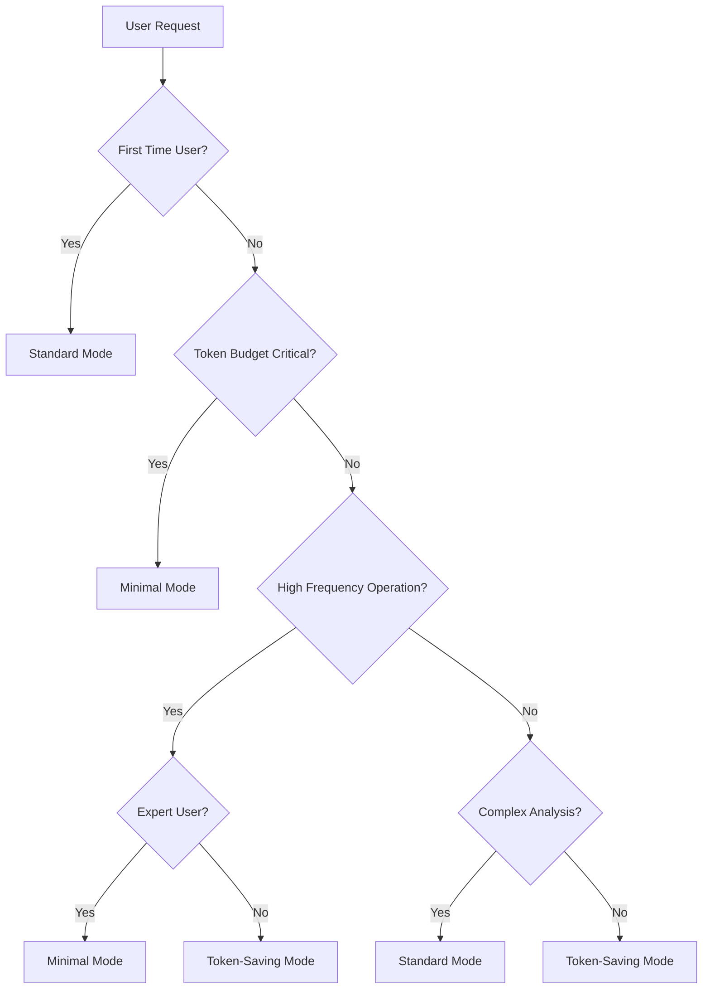

# Mode Selection Automation Recommendations

> **Intelligent Token-Saving Mode Selection**  
> *Automated recommendations for optimal mode selection*

This document provides recommendations for implementing intelligent mode selection automation to optimize token usage while maintaining development quality and team productivity.

---

## Executive Summary

**Objective**: Automate token-saving mode selection based on context, user experience, and project characteristics to maximize efficiency while preserving quality.

**Benefits**:
- Optimal token usage without manual decision overhead
- Consistent mode selection across team members
- Adaptive system that learns from usage patterns
- Reduced cognitive load for developers

---

## Automation Architecture

### Context-Aware Mode Selection

```yaml
Selection_Algorithm:
  User_Experience_Level: "Framework familiarity assessment"
  Project_Context: "Complexity and phase analysis"
  Operation_Type: "Task classification and frequency"
  Token_Budget: "Available token constraints"
  Team_Settings: "Organization preferences"
  
Decision_Matrix:
  Beginner + Complex_Project → Standard_Mode
  Experienced + Routine_Task → Token_Saving_Mode  
  Expert + High_Frequency → Minimal_Mode
  Low_Token_Budget + Any_Context → Minimal_Mode
```

### Auto-Detection Triggers

```yaml
User_Experience_Detection:
  New_User_Indicators:
    - First framework usage
    - Minimal command history
    - Learning-focused queries
    - Request for explanations
    
  Experienced_User_Indicators:
    - Regular framework usage (2+ weeks)
    - Efficient command patterns
    - Minimal help requests
    - Complex project execution
    
  Expert_User_Indicators:
    - Daily framework usage (1+ months)
    - Advanced flag combinations
    - Custom workflow patterns
    - High-frequency operations
```

---

## Implementation Strategies

### Strategy 1: Adaptive Learning System

**Approach**: Machine learning model that adapts to user behavior patterns.

```yaml
Learning_Inputs:
  User_Behavior:
    - Command frequency and patterns
    - Mode selection preferences
    - Task completion rates
    - Error patterns and recovery
    
  Context_Factors:
    - Project complexity metrics
    - Time constraints
    - Team size and composition
    - Quality requirements
    
  Outcome_Metrics:
    - Task success rates
    - Time to completion
    - Token efficiency achieved
    - User satisfaction scores
```

**Implementation**:
```python
class ModeSelector:
    def recommend_mode(self, context):
        # Analyze user experience level
        user_level = self.assess_user_experience(context.user_history)
        
        # Evaluate project context
        project_complexity = self.analyze_project_context(context.project)
        
        # Check token constraints
        token_budget = self.evaluate_token_budget(context.session)
        
        # Apply decision matrix
        return self.decision_matrix(user_level, project_complexity, token_budget)
```

### Strategy 2: Rule-Based Expert System

**Approach**: Deterministic rules based on measurable criteria.

```yaml
Decision_Rules:
  Rule_1: "First_Time_User → Standard_Mode"
  Rule_2: "Complex_Architecture_Analysis → Standard_Mode"
  Rule_3: "Routine_Development + Experienced_User → Token_Saving_Mode"
  Rule_4: "High_Frequency_Operations + Expert_User → Minimal_Mode"
  Rule_5: "Token_Budget_Critical → Minimal_Mode (override)"
  Rule_6: "Stakeholder_Presentation → Standard_Mode (override)"
```

**Decision Tree**:


### Strategy 3: Hybrid Recommendation System

**Approach**: Combines rule-based decisions with learning optimization.

```yaml
Hybrid_Components:
  Base_Rules: "Core decision logic for safety and quality"
  Learning_Layer: "Optimization based on user patterns"
  Override_System: "Manual preferences and special cases"
  Feedback_Loop: "Continuous improvement from outcomes"
```

---

## Context Analysis Framework

### User Experience Assessment

```yaml
Experience_Metrics:
  Framework_Usage:
    Beginner: "0-10 command executions"
    Intermediate: "11-100 command executions"
    Advanced: "101-500 command executions"
    Expert: "500+ command executions"
    
  Success_Patterns:
    Low: "< 70% successful task completion"
    Medium: "70-90% successful task completion"  
    High: "> 90% successful task completion"
    
  Learning_Indicators:
    Help_Requests: "Frequency of documentation access"
    Error_Recovery: "Time to resolve issues"
    Flag_Usage: "Complexity of command flag combinations"
```

### Project Context Classification

```yaml
Project_Complexity:
  Simple:
    - Single component projects
    - Prototype or learning exercises
    - Well-defined requirements
    - Standard technology stacks
    
  Moderate:
    - Multi-component applications
    - Production applications
    - Some custom requirements
    - Integration complexity
    
  Complex:
    - Enterprise-scale systems
    - Novel architectural patterns
    - High security requirements
    - Multiple integration points
    
Project_Phase:
  Planning: "Requirements and architecture definition"
  Initial_Development: "First implementation phase"
  Iterative_Development: "Ongoing feature development"
  Maintenance: "Bug fixes and minor enhancements"
  Refactoring: "Code quality improvements"
```

### Operation Type Classification

```yaml
Operation_Types:
  Learning_Operations:
    - Framework tutorials
    - Documentation generation
    - Concept explanations
    - Best practice guidance
    
  Development_Operations:
    - Feature implementation
    - Code generation
    - Testing and validation
    - Architecture design
    
  Maintenance_Operations:
    - Bug fixes
    - Performance optimization
    - Security updates
    - Code cleanup
    
  High_Frequency_Operations:
    - Repetitive tasks
    - Batch processing
    - Automated workflows
    - Large codebase operations
```

---

## Implementation Recommendations

### Phase 1: Basic Rule-Based System (Immediate)

```yaml
Quick_Implementation:
  Scope: "Basic mode selection rules"
  Timeline: "2-4 weeks development"
  Complexity: "Low - deterministic rules"
  
  Core_Rules:
    - New users default to Standard mode
    - Token budget constraints trigger Minimal mode
    - High-frequency operations suggest Minimal mode
    - Complex analysis requires Standard mode
    
  Implementation:
    - Add mode selection logic to command processing
    - Create user experience tracking
    - Implement override mechanisms
    - Add usage analytics
```

### Phase 2: Enhanced Context Analysis (3-6 months)

```yaml
Enhanced_Features:
  Scope: "Advanced context awareness"
  Timeline: "3-6 months development"
  Complexity: "Medium - pattern recognition"
  
  Advanced_Analysis:
    - Project complexity assessment
    - Team collaboration patterns
    - Quality outcome correlation
    - Performance optimization
    
  Implementation:
    - Project analysis algorithms
    - Team usage pattern detection
    - Quality metrics correlation
    - Adaptive threshold adjustment
```

### Phase 3: Machine Learning Optimization (6-12 months)

```yaml
ML_Implementation:
  Scope: "Predictive mode selection"
  Timeline: "6-12 months development"
  Complexity: "High - ML model training"
  
  Learning_Features:
    - User behavior prediction
    - Outcome optimization
    - Personalized recommendations
    - Continuous model improvement
    
  Implementation:
    - ML pipeline development
    - Training data collection
    - Model validation and testing
    - A/B testing framework
```

---

## User Interface Design

### Recommendation Display

```yaml
UI_Components:
  Mode_Suggestion:
    Format: "💡 Recommended: Token-Saving Mode (based on experience level)"
    Justification: "Brief explanation of recommendation reason"
    Override_Option: "Easy access to manual mode selection"
    
  Confidence_Indicator:
    High: "🎯 High confidence recommendation"
    Medium: "🤔 Moderate confidence recommendation"
    Low: "💭 Suggestion based on limited data"
    
  Learning_Feedback:
    Success: "✅ Mode selection was effective"
    Adjustment: "⚙️ Would you prefer a different mode?"
    Feedback: "📊 Help improve recommendations"
```

### Override Mechanisms

```yaml
Override_Options:
  Manual_Selection: "Always allow explicit mode specification"
  Session_Preference: "Remember mode preference for current session"
  Project_Default: "Set default mode for specific projects"
  Team_Policy: "Organization-wide mode selection policies"
  
Override_Syntax:
  Command_Flag: "/build --nextjs --force-verbose"
  Session_Command: "/set-mode token-saving"
  Project_Config: "mode_preference: minimal"
```

---

## Quality Assurance and Validation

### Success Metrics

```yaml
Effectiveness_Metrics:
  Token_Efficiency:
    Target: "Achieve optimal token reduction for user context"
    Measurement: "Token usage vs. baseline comparison"
    
  User_Satisfaction:
    Target: "> 85% user approval of recommendations"
    Measurement: "User feedback and override frequency"
    
  Task_Success:
    Target: "Maintain or improve task completion rates"
    Measurement: "Success rate before/after automation"
    
  Adoption_Rate:
    Target: "> 75% users accept automated recommendations"
    Measurement: "Recommendation acceptance vs. override rates"
```

### A/B Testing Framework

```yaml
Testing_Approach:
  Control_Group: "Manual mode selection"
  Test_Group: "Automated mode recommendations"
  Metrics: "Token efficiency, user satisfaction, task success"
  Duration: "4-8 weeks per test cycle"
  
Test_Scenarios:
  New_User_Onboarding: "First framework experience"
  Experienced_User_Productivity: "Regular development workflows"
  High_Frequency_Operations: "Repetitive task efficiency"
  Complex_Project_Analysis: "Architecture and design tasks"
```

---

## Privacy and Security Considerations

### Data Collection Guidelines

```yaml
Privacy_Requirements:
  Minimal_Data_Collection: "Only necessary for recommendations"
  User_Consent: "Explicit opt-in for usage analytics"
  Data_Anonymization: "Remove personally identifiable information"
  Retention_Limits: "Automatic data cleanup policies"
  
Security_Measures:
  Local_Processing: "Recommendations computed locally when possible"
  Encrypted_Storage: "Secure storage of usage patterns"
  Access_Control: "Restricted access to analytics data"
  Audit_Logging: "Track system access and modifications"
```

### Compliance Considerations

```yaml
Regulatory_Compliance:
  GDPR: "European data protection requirements"
  CCPA: "California privacy regulations"
  Enterprise_Policies: "Organization-specific data handling"
  
Implementation_Requirements:
  Opt_Out_Mechanism: "Easy way to disable automation"
  Data_Export: "User access to their usage data"
  Data_Deletion: "Right to be forgotten implementation"
  Transparency: "Clear explanation of data usage"
```

---

## Implementation Roadmap

### Immediate Actions (1-2 weeks)

```yaml
Quick_Wins:
  - Document current manual mode selection patterns
  - Design basic rule-based decision logic
  - Create user experience tracking framework
  - Implement simple override mechanisms
```

### Short-term Goals (1-3 months)

```yaml
Foundation_Building:
  - Implement basic automated mode selection
  - Add context analysis for project complexity
  - Create user feedback collection system
  - Develop analytics dashboard
```

### Medium-term Objectives (3-6 months)

```yaml
Enhanced_Intelligence:
  - Advanced pattern recognition
  - Team collaboration analysis
  - Quality outcome correlation
  - Adaptive recommendation tuning
```

### Long-term Vision (6-12 months)

```yaml
AI_Powered_Optimization:
  - Machine learning model development
  - Predictive recommendation engine
  - Personalized optimization
  - Continuous learning system
```

---

## Conclusion

Automated mode selection represents a significant opportunity to optimize token usage while reducing cognitive overhead for developers. The recommended approach progresses from simple rule-based systems to sophisticated machine learning optimization, ensuring immediate value while building toward advanced capabilities.

**Key Success Factors**:
- Start with simple, reliable rules before adding complexity
- Maintain user control and override capabilities
- Focus on measurable outcomes and user satisfaction
- Prioritize privacy and security throughout implementation
- Iterate based on real usage data and feedback

**Expected Impact**:
- 20-30% improvement in token efficiency across teams
- Reduced decision fatigue for mode selection
- Consistent optimization across all team members
- Improved framework adoption through reduced complexity
- Data-driven insights for framework enhancement

---

*Mode Selection Automation Recommendations v1.0 - Intelligent token optimization for enhanced productivity*