# Product Requirements Prompt (PRP) - Tetris Game

## Product Information

**Product Name**: `Tetris Game`

> This product name is used throughout the documentation and in generated DESIGN.md files for consistent referencing.

## Product Objectives

Build `Tetris Game` - a modern browser-based Tetris game that provides classic Tetris gameplay with contemporary user experience enhancements including leaderboards, responsive design, and dark/light theme support.

**🎮 Live Demo**: **[Play the Tetris Game](https://tetris-game-ruddy.vercel.app/)**
**📂 Source Code**: **[GitHub Repository](https://github.com/MikeQin/tetris-game)**

## Project Location

Please create a subfolder named `tetris-game` to contain all code and artifacts of `Tetris Game`.

## Features

### Core Features (MVP)
- **Classic Tetris Gameplay**: Standard `Tetris Game` mechanics with falling tetrominoes
- **Player Name Entry**: Prompt player to enter their name when starting the game
- **Score Tracking**: Track player score, level, and lines cleared during gameplay
- **Game Controls**: Start, pause/resume, quit, and reset functionality
- **Game Over Handling**: Display final score and offer replay or quit options
- **Basic Leaderboard**: Local storage-based leaderboard showing top 10 scores

### Advanced Features (Future Phases)
- **Hold Feature**: Ability to hold a piece for later use
- **Next Piece Preview**: Show upcoming tetromino pieces
- **Level Progression**: Automatic level increases with increasing speed
- **Rules Section**: In-game tutorial explaining how to play Tetris
- **Sound Effects**: Audio feedback for piece placement, line clears, and game events
- **Multiplayer Mode**: Local or online multiplayer functionality

### User Experience Requirements for `Tetris Game`
- **Authentication**: Simple name entry for score tracking (no complex auth required)
- **Navigation**: Clean navigation between game, leaderboard, and rules sections
- **Data Management**: Local storage for game state persistence and score history
- **Notifications**: Visual feedback for game events (line clears, level up, game over)
- **Accessibility**: Keyboard controls with clear visual indicators

## Technical Stack and Specifications

### Frontend Technology
**Web Application**: Next.js, App Router, JavaScript, Tailwind CSS

**Reasoning**: 
- Next.js provides excellent development experience and performance
- App Router offers modern routing capabilities
- JavaScript (not TypeScript) for simpler development as specified
- Tailwind CSS enables rapid UI development with consistent styling

### Backend Technology
**Client-Side Only**: No backend required for MVP
- **Data Storage**: Browser's localStorage for game state and leaderboard
- **Authentication**: None required (simple name entry only)
- **File Storage**: Static assets served by Next.js

### Infrastructure and Deployment
**Hosting**: Vercel (optimal for Next.js applications)
- **Database**: None required (localStorage sufficient for MVP)
- **CDN**: Vercel Edge Network (included)
- **Monitoring**: Basic Vercel analytics

### Development Requirements
- **Code Quality**: ESLint for JavaScript linting and code quality
- **Testing**: Jest for unit testing of game logic functions
- **Version Control**: Git with conventional commit messages
- **CI/CD**: Vercel automatic deployment from Git
- **Documentation**: README with setup instructions and game rules

## Technical Specifications

### Performance Requirements
- **Load Time**: Initial page load < 2 seconds on modern browsers
- **Response Time**: Game input response < 50ms for smooth gameplay
- **Throughput**: Handle 60fps gameplay without lag or stuttering
- **Storage**: Minimal local storage usage (< 1MB for leaderboard data)
- **Scalability**: Support for single-player gameplay initially

### Security Requirements
- **Data Protection**: No personal data collection beyond player names
- **Authentication**: No authentication system required for MVP
- **Authorization**: No role-based access (single-player game)
- **Data Encryption**: Not required (local storage only)
- **Security Scanning**: Basic vulnerability scanning for dependencies

### Compatibility Requirements
- **Browser Support**: Chrome 90+, Firefox 88+, Safari 14+, Edge 90+
- **Device Support**: Desktop, tablet, and mobile responsive design
- **Operating Systems**: Web-based (platform independent)
- **Screen Sizes**: Minimum 320px width, optimized for 768px+ and mobile
- **Accessibility**: WCAG 2.1 AA compliance for keyboard navigation

## Development Guidance

### Architecture and Design Process
- Before actual development and implementation, create the architecture and design, and present it for review
- If the planned architecture and design meet the project goals, proceed with approval
- Follow established patterns from CLAUDE.md for code organization and structure

### Quality Assurance Standards
- **Code Quality**: Run ESLint frequently during development to ensure lint-free code
- **Testing Strategy**: Implement unit tests for game logic, scoring, and state management
- **Build Verification**: Ensure the project builds successfully with `npm run build` before completion
- **Performance Testing**: Verify smooth 60fps gameplay on target devices
- **Security Testing**: Basic dependency vulnerability scanning

### Development Best Practices
- Break down large code blocks into small, focused functions
- Refactor code into multiple files when files exceed reasonable size limits
- Use meaningful variable and function names that clearly express intent
- Implement proper error handling and user feedback throughout the application
- Follow the Next.js and JavaScript conventions outlined in CLAUDE.md

### Success Criteria
- [ ] All core MVP features implemented and tested
- [ ] Application is completely lint-free and passes all quality gates
- [ ] Smooth gameplay performance on desktop and mobile devices
- [ ] Responsive design works across all target screen sizes
- [ ] Dark/light theme toggle functions correctly
- [ ] Ready for deployment to production environment

## Examples and References

### Live Implementation
- **🎮 [Live Demo](https://tetris-game-ruddy.vercel.app/)** - Play the actual working game built from this PRP
- **📂 [Source Code](https://github.com/MikeQin/tetris-game)** - Complete GitHub repository with full implementation
- **📋 [Requirements](./TETRIS_PRP.md)** - This PRP document that guided the implementation

### Similar Products or Implementations
- **Classic Reference**: https://www.freetetris.org/game.php - Standard Tetris gameplay mechanics
- **Code Examples**: 
  - https://github.com/jakesgordon/javascript-tetris - Well-structured JavaScript implementation
  - https://gist.github.com/straker/3c98304f8a6a9174efd8292800891ea1 - Minimal Tetris implementation

### Design Inspiration
- **UI/UX Examples**: Modern game interfaces with clean, minimalist design
- **Style Guides**: Classic Tetris color schemes with modern dark/light theme support
- **Component Libraries**: Tailwind CSS components for consistent styling

### Technical References
- **Framework Documentation**: Next.js App Router documentation and best practices
- **Game Development**: Canvas API or CSS-based animation techniques
- **Standards**: Tetris Guidelines for authentic gameplay mechanics

## Documentation Requirements

### User Documentation
- **User Guide**: Clear instructions for game controls and objectives
- **FAQ**: Common questions about gameplay, scoring, and features
- **Rules Section**: In-game tutorial explaining Tetris mechanics

### Developer Documentation
- **Setup Instructions**: Environment setup, installation, and development workflow
- **Architecture Documentation**: Component structure, state management, and data flow
- **Deployment Guide**: Production deployment to Vercel with configuration details

## Execution Workflow

### Phase 1: Planning and Design
1. **Read the existing `CLAUDE.md`** for Development Methodology (Engineering Standards)
2. **Generate `DESIGN.md`** using one of these methods:

**Option A: Claude CLI Command (Recommended)**
```bash
/generate_design ./example/TETRIS_PRP.md
```

**Option B: Manual AI Prompt**
```
I have created a PRODUCT_PRP.md file with my project requirements and I'm using CLAUDE.md for development methodology. Please read both files and generate a comprehensive DESIGN.md document that includes:

1. Problem statement and context
2. Possible implementation approaches with trade-offs
3. Architecture and system design
4. Testing strategy (unit tests, integration tests, security scans)
5. Technology stack justification 
6. Project structure (tree-style directory layout)
7. External dependencies and integrations
8. Documentation references
9. Acceptance criteria and success metrics
10. Technical diagrams (Mermaid diagrams when helpful)

Please ensure the DESIGN.md follows the architecture patterns and quality standards defined in CLAUDE.md, and fully addresses all requirements specified in PRODUCT_PRP.md.

Lastly, save the generated file as 'TETRIS_GAME_DESIGN.md' in the current directory (./example/).
```

3. **Review the generated `DESIGN.md`** for Architecture & Implementation (Technical Design) ensuring it includes:
   - Problem statement and context
   - Possible implementation approaches with trade-offs
   - Architecture and system design for game state management
   - Testing strategy (unit tests for game logic, integration tests)
   - Security considerations and vulnerability assessment
   - Technology stack justification and component architecture
   - Project structure (tree-style directory layout)
   - External dependencies and integrations
   - Documentation references and examples
   - Acceptance criteria and success metrics
   - Technical diagrams (Mermaid diagrams for game flow and component relationships)

### Phase 2: Implementation
4. **Use this PRP, generated `DESIGN.md`, and `CLAUDE.md`** to guide implementation
5. **Follow iterative development** with regular quality checks and testing
6. **Maintain documentation** throughout the development process

### Phase 3: Quality Assurance and Deployment
7. **Complete all quality gates** defined in the success criteria
8. **Perform final testing** on all target devices and browsers
9. **Prepare for deployment** with production-ready configuration

## Context Engineering Workflow

**Complete Development Process for Tetris Game:**

```mermaid
graph TD
    A["📋 TETRIS_PRP.md<br/>(Product Requirements)"] --> B["🔧 /generate_design<br/>./example/TETRIS_PRP.md"]
    B --> C["📐 AI Generates<br/>TETRIS_GAME_DESIGN.md"]
    C --> D["👥 Review & Approve<br/>Technical Architecture"]
    D --> E["🚀 /execute_project<br/>./tetris-game"]
    E --> F["⚙️ Implementation with<br/>CLAUDE.md Standards"]
    F --> G["✅ Quality Gates<br/>Tests, Lint, Build"]
    G --> H["📚 Documentation<br/>& Code Comments"]
    H --> I["🎉 Deployment Ready<br/>Tetris Game"]
    
    style A fill:#e3f2fd
    style C fill:#f3e5f5
    style E fill:#e8f5e8
    style I fill:#fff3e0
```



**Framework Benefits Demonstrated:**
- **🎯 Clear Requirements**: TETRIS_PRP.md defines exactly what to build
- **🏗️ Systematic Architecture**: Generated DESIGN.md provides complete technical foundation  
- **🔧 Consistent Implementation**: CLAUDE.md ensures quality standards throughout
- **🚀 Production Ready**: Complete working game with testing and deployment

## Additional Considerations

### Risk Assessment
- **Technical Risks**: Browser compatibility issues with game animations, performance on mobile devices
- **Timeline Risks**: Complex game logic implementation, responsive design challenges
- **Security Risks**: Minimal (client-side only application with no sensitive data)
- **Business Risks**: User adoption dependent on gameplay quality and performance

### Maintenance and Support
- **Update Frequency**: Bug fixes as needed, feature updates quarterly
- **Support Level**: Community support through documentation and examples
- **Monitoring**: Basic error tracking and performance monitoring
- **Backup and Recovery**: Git version control (no user data to backup)

### Future Considerations
- **Roadmap**: Advanced features like multiplayer, tournaments, custom themes
- **Scalability**: Potential backend integration for global leaderboards
- **Technology Evolution**: Migration to TypeScript, PWA capabilities
- **Team Growth**: Modular architecture supports multiple developer contributions

---

**This PRP follows The Three-Document Pattern Context Engineering Framework for systematic AI-assisted development.**