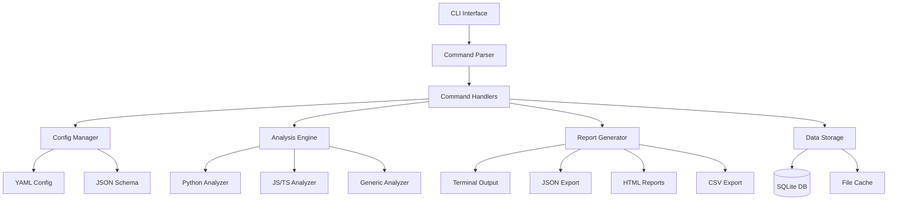
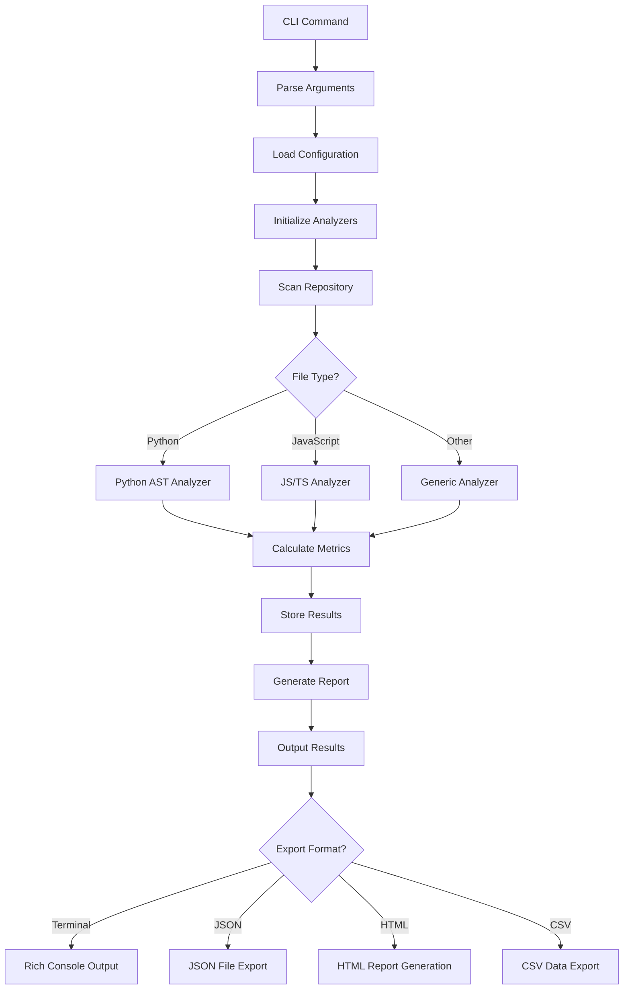
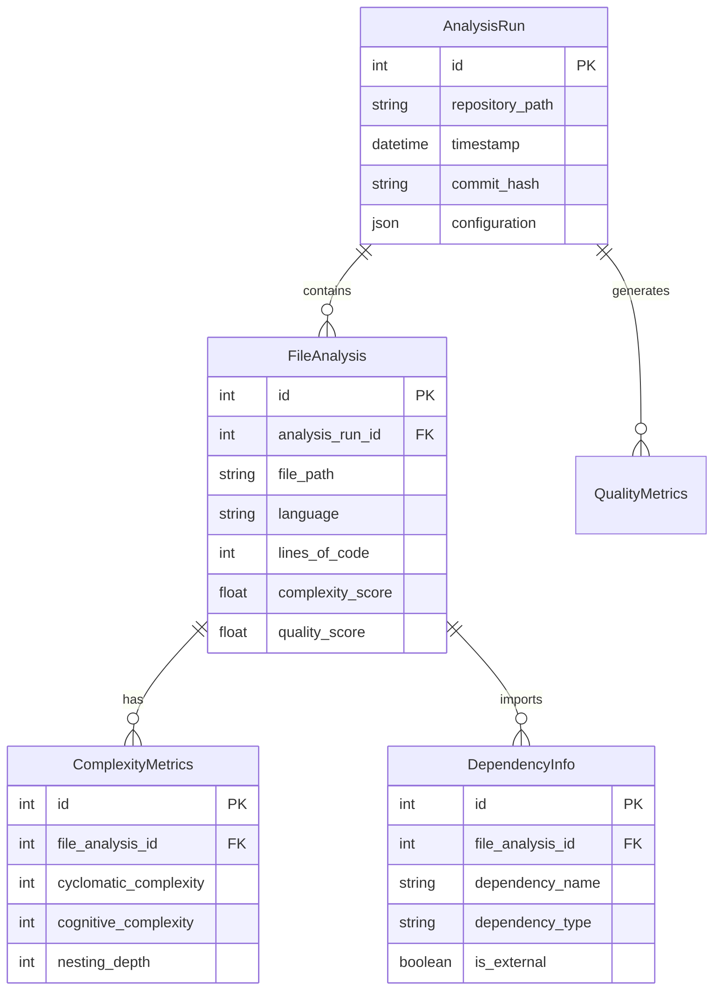

# Repo Analyzer CLI Tool - Technical Design Document

## 1. Problem Statement and Context

### Challenge
Modern software development involves managing complex codebases with multiple programming languages, dependencies, and architectural patterns. Developers struggle to understand code quality, identify technical debt, and maintain consistent coding standards across repositories. Manual code review and analysis is time-consuming, error-prone, and doesn't scale with team growth or repository complexity.

### Solution Overview
The **repo-analyzer** CLI tool provides automated, comprehensive repository analysis that transforms code understanding from manual inspection into systematic, data-driven insights. It supports multiple programming languages, generates actionable reports, and integrates seamlessly into development workflows.

### Target Users
- **Individual Developers**: Understanding personal projects and code quality
- **Development Teams**: Standardizing code quality and review processes
- **Technical Leaders**: Monitoring technical debt and architecture evolution
- **DevOps Engineers**: Integrating quality gates into CI/CD pipelines

## 2. Implementation Approaches and Trade-offs

### Architecture Pattern Analysis

#### Option A: Monolithic CLI Architecture
**Structure**: Single large CLI application with all functionality in one package
```
repo-analyzer/
├── cli.py (all commands)
├── analyzers.py (all language analyzers)
├── reports.py (all report formats)
└── utils.py (shared utilities)
```
**Pros**: Simple deployment, easy to understand
**Cons**: Poor maintainability, difficult testing, tight coupling
**Decision**: ❌ Rejected - doesn't scale with feature complexity

#### Option B: Plugin-Based Architecture  
**Structure**: Core engine with loadable plugins for languages and reports
```
repo-analyzer/
├── core/
├── plugins/
│   ├── analyzers/
│   └── reports/
└── registry.py (plugin discovery)
```
**Pros**: Highly extensible, supports third-party plugins
**Cons**: Complex initialization, plugin compatibility issues
**Decision**: 🔄 Future consideration - adds unnecessary complexity for MVP

#### Option C: Modular CLI Architecture (Selected)
**Structure**: Well-organized modules with clear separation of concerns
```
repo-analyzer/
├── cli.py (command orchestration)
├── commands/ (command implementations)
├── analyzers/ (language-specific analysis)
├── reports/ (format generators)
├── config/ (configuration management)
├── storage/ (data persistence)
└── utils/ (shared utilities)
```
**Pros**: ✅ Maintainable, testable, clear separation, extensible
**Cons**: More initial setup complexity
**Decision**: ✅ Selected - balances simplicity with scalability

### Language Parser Strategy

#### Option A: AST-Based Analysis (Selected for Primary Languages)
**Implementation**: Use language-native AST parsers (Python `ast`, JavaScript `acorn`)
**Pros**: ✅ Deep semantic analysis, accurate complexity metrics
**Cons**: Language-specific implementation required
**Decision**: ✅ Primary approach for Python, JavaScript, TypeScript

#### Option B: Regular Expression Analysis
**Implementation**: Pattern matching for basic metrics (lines, comments, imports)
**Pros**: Language-agnostic, simple to implement
**Cons**: Limited depth, error-prone for complex analysis
**Decision**: 🔄 Fallback for unsupported languages

#### Option C: Tree-sitter Universal Parsing
**Implementation**: Use tree-sitter for consistent parsing across languages
**Pros**: Consistent API, supports many languages
**Cons**: Additional dependency, learning curve
**Decision**: 🔄 Future enhancement for broader language support

## 3. System Architecture and Design

### High-Level Architecture



### Core Components Design

#### CLI Interface (Click Framework)
```python
# Command structure
@click.group()
@click.option('--config', help='Configuration file path')
@click.option('--verbose', '-v', is_flag=True, help='Verbose output')
def cli(config, verbose):
    """Repo Analyzer - Comprehensive repository analysis tool"""
    pass

@cli.group()
def analyze():
    """Analysis commands"""
    pass

@analyze.command()
@click.argument('repository_path', type=click.Path(exists=True))
@click.option('--language', help='Filter by programming language')
def structure(repository_path, language):
    """Analyze repository structure and organization"""
    pass
```

#### Analysis Engine Architecture
```python
# Base analyzer interface
class BaseAnalyzer:
    def analyze_file(self, file_path: Path) -> FileAnalysis:
        """Analyze a single file"""
        raise NotImplementedError
    
    def analyze_directory(self, dir_path: Path) -> DirectoryAnalysis:
        """Analyze directory structure"""
        raise NotImplementedError
    
    def calculate_metrics(self, analysis: FileAnalysis) -> MetricsResult:
        """Calculate code quality metrics"""
        raise NotImplementedError

# Language-specific implementation
class PythonAnalyzer(BaseAnalyzer):
    def analyze_file(self, file_path: Path) -> FileAnalysis:
        with open(file_path, 'r') as f:
            tree = ast.parse(f.read())
        
        return FileAnalysis(
            file_path=file_path,
            language='python',
            lines_of_code=self._count_loc(tree),
            complexity=self._calculate_complexity(tree),
            imports=self._extract_imports(tree),
            functions=self._extract_functions(tree),
            classes=self._extract_classes(tree)
        )
```

#### Configuration Management
```python
# Configuration schema
CONFIG_SCHEMA = {
    "type": "object",
    "properties": {
        "project": {
            "type": "object",
            "properties": {
                "name": {"type": "string"},
                "languages": {"type": "array", "items": {"type": "string"}},
                "exclude_patterns": {"type": "array", "items": {"type": "string"}}
            }
        },
        "analysis": {
            "type": "object",
            "properties": {
                "complexity": {
                    "type": "object",
                    "properties": {
                        "cyclomatic_threshold": {"type": "integer", "minimum": 1},
                        "cognitive_threshold": {"type": "integer", "minimum": 1}
                    }
                }
            }
        }
    }
}

class ConfigManager:
    def load_config(self, config_path: Path) -> Dict[str, Any]:
        """Load and validate configuration"""
        with open(config_path, 'r') as f:
            config = yaml.safe_load(f)
        
        jsonschema.validate(config, CONFIG_SCHEMA)
        return config
```

#### Data Storage Design
```python
# SQLAlchemy models for analysis history
class AnalysisRun(Base):
    __tablename__ = 'analysis_runs'
    
    id = Column(Integer, primary_key=True)
    repository_path = Column(String, nullable=False)
    timestamp = Column(DateTime, default=datetime.utcnow)
    commit_hash = Column(String)
    configuration = Column(JSON)
    
    file_analyses = relationship("FileAnalysis", back_populates="analysis_run")

class FileAnalysis(Base):
    __tablename__ = 'file_analyses'
    
    id = Column(Integer, primary_key=True)
    analysis_run_id = Column(Integer, ForeignKey('analysis_runs.id'))
    file_path = Column(String, nullable=False)
    language = Column(String)
    lines_of_code = Column(Integer)
    complexity_score = Column(Float)
    quality_score = Column(Float)
    
    analysis_run = relationship("AnalysisRun", back_populates="file_analyses")
```

### Package Structure Implementation

```
repo-analyzer/
├── src/
│   └── repo_analyzer/
│       ├── __init__.py                 # Package initialization
│       ├── __main__.py                 # Entry point: python -m repo_analyzer
│       ├── cli.py                      # Main CLI interface with Click
│       │
│       ├── commands/                   # Command implementations
│       │   ├── __init__.py
│       │   ├── analyze.py              # analyze command group
│       │   ├── report.py               # report command group
│       │   ├── config.py               # config command group
│       │   └── history.py              # history command group
│       │
│       ├── analyzers/                  # Language analyzers
│       │   ├── __init__.py
│       │   ├── base.py                 # BaseAnalyzer abstract class
│       │   ├── python_analyzer.py      # Python AST analysis
│       │   ├── javascript_analyzer.py  # JS/TS analysis
│       │   ├── java_analyzer.py        # Java analysis
│       │   ├── go_analyzer.py          # Go analysis
│       │   └── generic_analyzer.py     # Generic file analysis
│       │
│       ├── reports/                    # Report generation
│       │   ├── __init__.py
│       │   ├── generators.py           # Report format generators
│       │   ├── formatters.py           # Output formatting
│       │   └── templates/              # HTML templates
│       │       ├── summary.html
│       │       └── detailed.html
│       │
│       ├── config/                     # Configuration management
│       │   ├── __init__.py
│       │   ├── manager.py              # Configuration loading/validation
│       │   ├── schemas.py              # JSON schema definitions
│       │   └── defaults.py             # Default configuration values
│       │
│       ├── storage/                    # Data persistence
│       │   ├── __init__.py
│       │   ├── database.py             # SQLite database operations
│       │   ├── models.py               # SQLAlchemy models
│       │   └── migrations/             # Database schema migrations
│       │
│       ├── utils/                      # Utility functions
│       │   ├── __init__.py
│       │   ├── file_utils.py           # File operations and patterns
│       │   ├── git_utils.py            # Git repository integration
│       │   ├── metrics.py              # Metric calculation utilities
│       │   └── output.py               # Terminal output formatting
│       │
│       └── exceptions.py               # Custom exception classes
│
├── tests/                              # Test suite
│   ├── __init__.py
│   ├── conftest.py                     # pytest configuration and fixtures
│   ├── test_cli.py                     # CLI integration tests
│   ├── test_commands/                  # Command-specific tests
│   │   ├── test_analyze.py
│   │   ├── test_report.py
│   │   ├── test_config.py
│   │   └── test_history.py
│   ├── test_analyzers/                 # Analyzer unit tests
│   │   ├── test_python_analyzer.py
│   │   ├── test_javascript_analyzer.py
│   │   └── test_generic_analyzer.py
│   ├── test_reports/                   # Report generation tests
│   │   ├── test_generators.py
│   │   └── test_formatters.py
│   ├── test_storage/                   # Storage layer tests
│   │   ├── test_database.py
│   │   └── test_models.py
│   └── fixtures/                       # Test data
│       ├── sample_repos/               # Sample repositories for testing
│       ├── config_files/               # Test configuration files
│       └── expected_outputs/           # Expected analysis results
│
├── docs/                               # Documentation
│   ├── README.md                       # User documentation
│   ├── CONTRIBUTING.md                 # Developer guide
│   ├── API.md                          # API documentation
│   └── examples/                       # Usage examples
│
├── pyproject.toml                      # Modern Python packaging
├── requirements/                       # Dependency management
│   ├── base.txt                        # Core dependencies
│   ├── dev.txt                         # Development dependencies
│   └── test.txt                        # Testing dependencies
├── .github/                            # GitHub workflows
│   └── workflows/
│       ├── ci.yml                      # Continuous integration
│       └── release.yml                 # Release automation
├── Dockerfile                          # Container support
├── docker-compose.yml                  # Development environment
└── Makefile                           # Development commands
```

## 4. Technology Stack Justification

### Core Framework Selection

#### Click vs Argparse vs Typer
**Selected: Click**
- ✅ Mature, well-documented CLI framework
- ✅ Excellent command grouping and nesting
- ✅ Built-in testing utilities
- ✅ Rich ecosystem and community support
- ❌ More verbose than Typer for simple commands

**Justification**: Click provides the best balance of features, stability, and testing support for a complex CLI application with multiple command groups.

#### Rich vs Colorama for Terminal Output
**Selected: Rich**
- ✅ Advanced formatting (tables, progress bars, syntax highlighting)
- ✅ Automatic terminal capability detection
- ✅ Built-in support for complex layouts
- ❌ Larger dependency size

**Justification**: Rich enables professional-quality terminal output essential for data-heavy analysis reports.

### Data Storage Strategy

#### SQLite vs JSON Files vs In-Memory
**Selected: SQLite with SQLAlchemy**
- ✅ Structured queries for historical analysis
- ✅ ACID compliance for data integrity
- ✅ No external database dependencies
- ✅ Efficient storage for large datasets
- ❌ Additional ORM complexity

**Justification**: SQLite provides robust data persistence required for historical analysis and comparison features.

### Analysis Engine Technologies

#### Python AST vs Third-party Parsers
**Selected: Language-native parsers (Python AST, Acorn for JS)**
- ✅ Most accurate and complete parsing
- ✅ Access to full semantic information
- ✅ No additional dependencies for Python
- ❌ Language-specific implementation effort

**Justification**: Native parsers provide the depth of analysis required for accurate complexity and quality metrics.

## 5. Testing Strategy

### Testing Architecture

#### Unit Testing (pytest)
```python
# Test structure example
class TestPythonAnalyzer:
    @pytest.fixture
    def sample_python_file(self, tmp_path):
        code = '''
def calculate_complexity(data):
    if not data:
        return 0
    
    result = 0
    for item in data:
        if item > 0:
            result += item * 2
        else:
            result += item
    return result
'''
        file_path = tmp_path / "sample.py"
        file_path.write_text(code)
        return file_path
    
    def test_analyze_file_complexity(self, sample_python_file):
        analyzer = PythonAnalyzer()
        analysis = analyzer.analyze_file(sample_python_file)
        
        assert analysis.language == 'python'
        assert analysis.complexity.cyclomatic == 4
        assert len(analysis.functions) == 1
        assert analysis.functions[0].name == 'calculate_complexity'
```

#### CLI Integration Testing
```python
# CLI testing with Click's test utilities
def test_analyze_structure_command():
    runner = CliRunner()
    with runner.isolated_filesystem():
        # Create test repository structure
        os.makedirs('src/utils')
        Path('src/main.py').write_text('print("hello")')
        Path('src/utils/helper.py').write_text('def helper(): pass')
        
        result = runner.invoke(cli, ['analyze', 'structure', '.'])
        
        assert result.exit_code == 0
        assert 'Structure:' in result.output
        assert '2 files' in result.output
```

#### Performance Testing
```python
def test_large_repository_performance():
    """Test analysis performance on large repositories"""
    start_time = time.time()
    
    analyzer = RepositoryAnalyzer()
    result = analyzer.analyze_repository(LARGE_TEST_REPO_PATH)
    
    execution_time = time.time() - start_time
    
    assert execution_time < 30.0  # Must complete within 30 seconds
    assert len(result.file_analyses) > 10000  # Should handle 10k+ files
```

### Test Coverage Requirements

**Coverage Targets:**
- Overall: 90%+ code coverage
- Critical paths (analyzers, CLI commands): 95%+
- Utility functions: 85%+
- Configuration loading: 100%

**Testing Types:**
1. **Unit Tests**: Individual function and class testing
2. **Integration Tests**: Command workflow testing
3. **End-to-End Tests**: Full analysis pipeline testing
4. **Performance Tests**: Large repository benchmarks
5. **Regression Tests**: Historical comparison accuracy

### Test Data Management
```
tests/fixtures/
├── sample_repos/
│   ├── python_project/          # Sample Python repository
│   ├── javascript_project/      # Sample JS/TS repository
│   ├── mixed_language_project/  # Multi-language repository
│   └── large_project/           # Performance testing repository
├── config_files/
│   ├── minimal_config.yml       # Basic configuration
│   ├── comprehensive_config.yml # Full feature configuration
│   └── invalid_config.yml       # Error testing configuration
└── expected_outputs/
    ├── python_analysis.json     # Expected Python analysis results
    └── summary_reports/          # Expected report outputs
```

## 6. External Dependencies and Integrations

### Core Dependencies

#### Runtime Dependencies
```toml
[project]
dependencies = [
    "click>=8.0.0",          # CLI framework - stable, mature
    "rich>=13.0.0",          # Terminal formatting - modern output
    "pyyaml>=6.0.0",         # Configuration parsing - YAML support
    "gitpython>=3.1.0",      # Git integration - repository analysis
    "jsonschema>=4.0.0",     # Configuration validation - schema enforcement
    "sqlalchemy>=2.0.0",     # Database ORM - data persistence
    "jinja2>=3.1.0",         # HTML templating - report generation
    "toml>=0.10.0",          # TOML parsing - pyproject.toml support
    "pathspec>=0.11.0",      # Pattern matching - .gitignore support
]
```

#### Development Dependencies
```toml
[project.optional-dependencies]
dev = [
    "pytest>=7.0.0",        # Testing framework
    "pytest-cov>=4.0.0",    # Coverage reporting
    "pytest-asyncio>=0.21.0", # Async testing support
    "black>=23.0.0",        # Code formatting
    "ruff>=0.1.0",          # Fast linting and formatting
    "mypy>=1.0.0",          # Static type checking
    "pre-commit>=3.0.0",    # Git hooks for quality
]
```

### Git Integration Strategy
```python
# Git operations wrapper
class GitAnalyzer:
    def __init__(self, repo_path: Path):
        self.repo = git.Repo(repo_path)
    
    def get_file_history(self, file_path: str) -> List[CommitInfo]:
        """Get commit history for specific file"""
        commits = list(self.repo.iter_commits(paths=file_path))
        return [CommitInfo.from_commit(commit) for commit in commits]
    
    def compare_commits(self, commit1: str, commit2: str) -> DiffAnalysis:
        """Compare analysis between two commits"""
        diff = self.repo.commit(commit1).diff(commit2)
        return DiffAnalysis.from_git_diff(diff)
```

### CI/CD Integration Templates

#### GitHub Actions Workflow
```yaml
name: Repository Analysis
on:
  push:
    branches: [main, develop]
  pull_request:
    branches: [main]

jobs:
  analyze:
    runs-on: ubuntu-latest
    steps:
    - uses: actions/checkout@v4
      with:
        fetch-depth: 0  # Full history for trend analysis
    
    - name: Setup Python
      uses: actions/setup-python@v4
      with:
        python-version: '3.9'
    
    - name: Install repo-analyzer
      run: pip install repo-analyzer
    
    - name: Initialize analysis configuration
      run: repo-analyzer config init --preset python
    
    - name: Run comprehensive analysis
      run: |
        repo-analyzer analyze structure --format json > structure.json
        repo-analyzer analyze quality --fail-on-regression --threshold-file .quality-gates.yml
        repo-analyzer report export --format html --output analysis-report.html
    
    - name: Upload analysis artifacts
      uses: actions/upload-artifact@v3
      with:
        name: analysis-results
        path: |
          structure.json
          analysis-report.html
    
    - name: Comment PR with analysis summary
      if: github.event_name == 'pull_request'
      uses: actions/github-script@v6
      with:
        script: |
          const fs = require('fs');
          const summary = fs.readFileSync('structure.json', 'utf8');
          github.rest.issues.createComment({
            issue_number: context.issue.number,
            owner: context.repo.owner,
            repo: context.repo.repo,
            body: `## Code Analysis Results\n\`\`\`json\n${summary}\n\`\`\``
          });
```

## 7. Documentation References

### User Documentation Structure
```
docs/
├── README.md                    # Quick start and overview
├── installation.md              # Installation methods and troubleshooting
├── configuration.md             # Configuration file reference
├── commands/                    # Command documentation
│   ├── analyze.md              # Analysis commands reference
│   ├── report.md               # Reporting commands reference
│   ├── config.md               # Configuration commands
│   └── history.md              # History management commands
├── integrations/               # Integration guides
│   ├── github-actions.md       # GitHub Actions setup
│   ├── gitlab-ci.md           # GitLab CI configuration
│   └── pre-commit.md          # Pre-commit hooks setup
├── examples/                   # Usage examples
│   ├── quick-start.md         # 5-minute tutorial
│   ├── ci-cd-setup.md         # Continuous integration setup
│   └── advanced-usage.md      # Complex workflows
└── api/                       # API documentation
    ├── analyzers.md           # Analyzer interface documentation
    ├── reports.md             # Report format specifications
    └── extensions.md          # Plugin development guide
```

### API Documentation Standards
- **Docstring Format**: Google-style docstrings with type hints
- **Configuration Reference**: JSON schema documentation
- **Command Reference**: Auto-generated from Click decorators
- **Example Code**: Executable examples in documentation

## 8. Acceptance Criteria and Success Metrics

### Functional Acceptance Criteria

#### Core Analysis Functionality
✅ **Structure Analysis**
- Accurately count files, directories, and lines of code
- Identify programming language distribution
- Detect project organization patterns
- Generate file size and complexity distributions

✅ **Dependency Analysis**
- Parse package.json, requirements.txt, go.mod, Cargo.toml
- Identify direct and transitive dependencies
- Detect circular dependencies within project
- Flag known vulnerable dependencies

✅ **Quality Metrics**
- Calculate cyclomatic complexity for functions
- Measure cognitive complexity
- Identify code duplication patterns
- Generate maintainability index scores

#### Reporting and Export
✅ **Multiple Output Formats**
- Terminal-formatted summary reports
- JSON export for programmatic usage
- HTML reports with interactive charts
- CSV export for spreadsheet analysis

✅ **Historical Analysis**
- Store analysis results with timestamps
- Compare metrics between commits/branches
- Track quality trends over time
- Generate regression reports

#### Configuration and Integration
✅ **Flexible Configuration**
- YAML-based configuration files
- Command-line parameter override
- Language-specific analysis rules
- Exclude patterns (gitignore-style)

### Performance Success Criteria

#### Analysis Speed Requirements
- **Small repositories** (< 100 files): < 5 seconds
- **Medium repositories** (100-1,000 files): < 15 seconds  
- **Large repositories** (1,000-10,000 files): < 30 seconds
- **Very large repositories** (10,000+ files): < 60 seconds

#### Memory Usage Constraints
- **Maximum memory usage**: 500MB for 10,000+ file repositories
- **Incremental processing**: Support for streaming analysis
- **Cache efficiency**: 80%+ cache hit rate for repeated analysis

#### Accuracy Requirements
- **Code complexity**: 95%+ accuracy vs manual calculation
- **Dependency detection**: 98%+ accuracy for supported package managers
- **Language detection**: 99%+ accuracy using file extensions and content

### User Experience Success Criteria

#### Installation and Setup
✅ **Easy Installation**
- Single command installation: `pip install repo-analyzer`
- No complex dependencies or system requirements
- Cross-platform support (Linux, macOS, Windows)
- Docker container support for isolated execution

✅ **Quick Onboarding**
- New users productive within 10 minutes
- Intuitive command structure and help text
- Auto-generated configuration with sensible defaults
- Built-in examples and tutorials

#### Error Handling and Recovery
✅ **Graceful Error Handling**
- Clear, actionable error messages
- Automatic recovery from partial failures
- Detailed logging for troubleshooting
- Validation of configuration and inputs

#### Output Quality
✅ **Professional Reports**
- Clear, readable terminal output
- Professional HTML reports suitable for stakeholders
- Actionable recommendations with specific file locations
- Historical trend visualization

### Technical Quality Success Criteria

#### Code Quality Standards
✅ **Testing Coverage**
- 90%+ overall test coverage
- 95%+ coverage for critical analysis paths
- 100% coverage for configuration validation
- Performance regression tests

✅ **Code Quality**
- Type hints for all public interfaces
- Comprehensive docstrings following Google style
- Linting compliance (ruff, black formatting)
- Static type checking with mypy

#### Maintainability and Extensibility
✅ **Architecture Quality**
- Clear separation of concerns between modules
- Plugin architecture for new language analyzers
- Backward-compatible configuration schema
- Comprehensive API documentation

#### Security and Reliability
✅ **Security Standards**
- No execution of analyzed code
- Safe handling of file system operations
- Input validation and sanitization
- Dependency vulnerability scanning

### Success Metrics Dashboard

#### Quantitative Metrics
```yaml
Performance Metrics:
  analysis_speed_10k_files: "<30s"
  memory_usage_max: "<500MB"
  accuracy_complexity_detection: ">95%"
  accuracy_dependency_detection: ">98%"

Quality Metrics:
  test_coverage: ">90%"
  type_coverage: ">95%"
  documentation_coverage: ">90%"
  linting_compliance: "100%"

User Experience Metrics:
  installation_success_rate: ">99%"
  first_run_success_rate: ">95%"
  error_resolution_rate: ">90%"
  user_satisfaction_score: ">4.5/5"
```

#### Qualitative Acceptance Criteria
- Users report repo-analyzer saves significant time vs manual code review
- Development teams successfully integrate into existing workflows
- Generated reports provide actionable insights for code improvement
- Tool enables data-driven technical debt management decisions

---

## Technical Implementation Diagrams

### Analysis Pipeline Flow


### Data Model Relationships


---

**Repo Analyzer Design Document**: Complete technical architecture for a professional-grade repository analysis CLI tool that transforms code understanding into systematic, data-driven insights for modern software development teams.