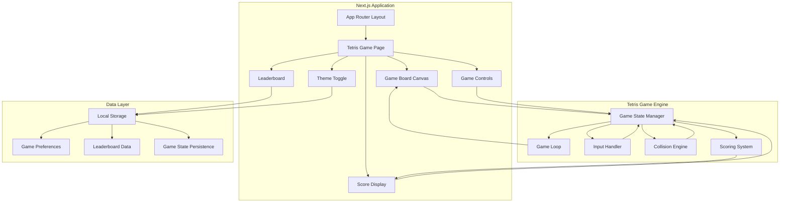
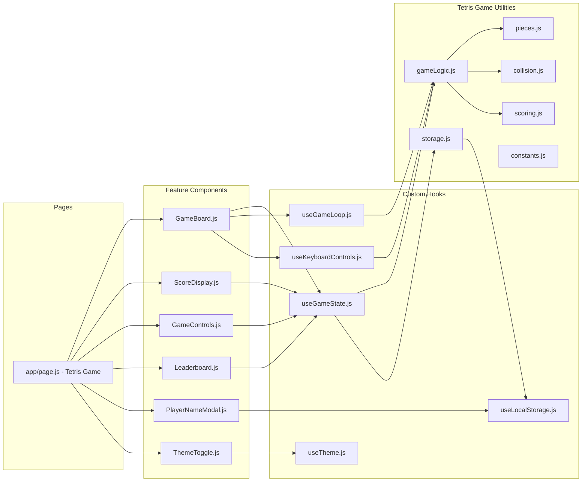
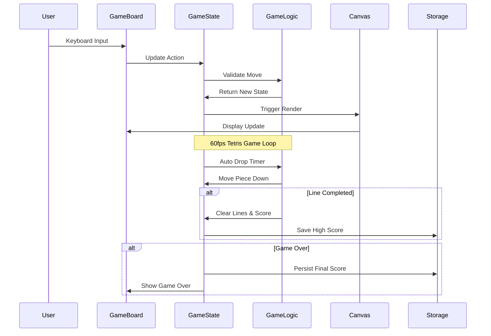
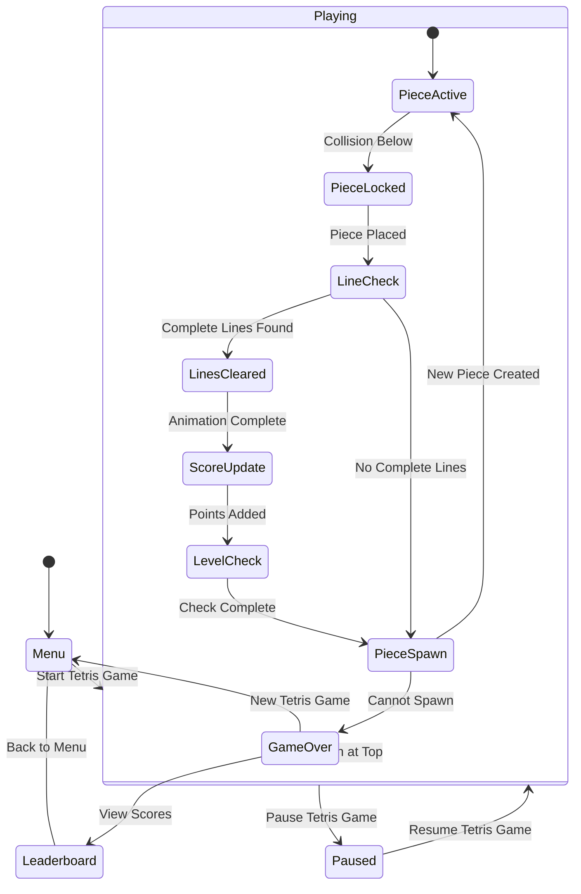
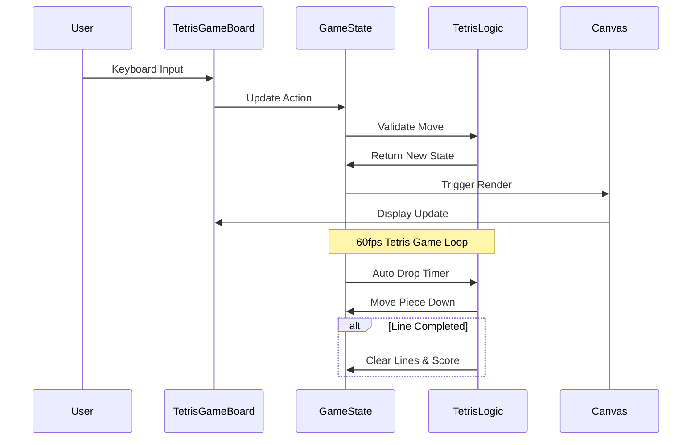
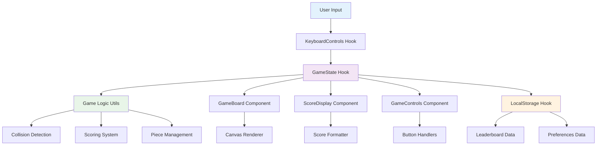
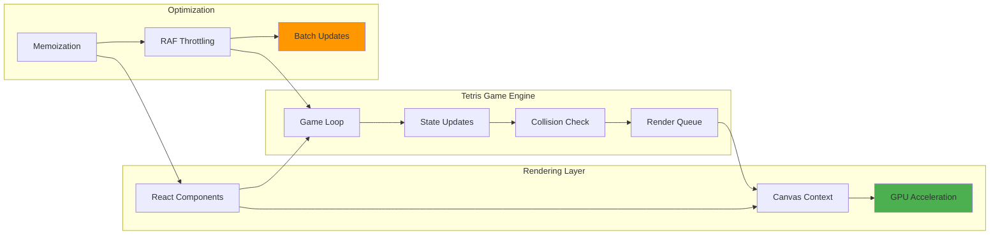

# TETRIS_GAME_DESIGN.md - Tetris Game Technical Architecture

> **Generated using**: `/generate_design ./examples/TETRIS_PRP.md`  
> **Product Name**: `Tetris Game` (extracted from PRP)  
> **Framework**: The Three-Document Pattern Context Engineering Framework  
> **Source Requirements**: [TETRIS_PRP.md](./TETRIS_PRP.md)  
> **Development Methodology**: [CLAUDE.md](./CLAUDE.md)

## Problem Statement and Context

### Business Context
The project aims to demonstrate The Three-Document Pattern Context Engineering Framework's effectiveness by building `Tetris Game` - a modern browser-based Tetris game. This serves as both a functional gaming application and a comprehensive example of systematic AI-assisted development.

### Technical Requirements for Tetris Game
- **Performance**: 60fps gameplay with <50ms input response time
- **Compatibility**: Modern browsers (Chrome 90+, Firefox 88+, Safari 14+, Edge 90+)
- **Responsiveness**: Support devices from 320px mobile to desktop
- **Architecture**: Clean, maintainable code following framework standards
- **Deployment**: Production-ready with live demo accessibility

### User Experience Goals for Tetris Game
- Classic Tetris gameplay with modern UX enhancements
- Responsive design across all target devices
- Local leaderboard system for score persistence
- Dark/light theme support for user preference
- Intuitive controls and visual feedback

## Possible Implementation Approaches for Tetris Game

### Approach 1: Canvas-Based Game Engine ⭐ **RECOMMENDED**

**Technical Implementation:**
- HTML5 Canvas for `Tetris Game` board rendering
- RequestAnimationFrame for 60fps game loop
- Direct pixel manipulation for smooth animations
- Canvas-based collision detection

**Advantages for Tetris Game:**
- ✅ Optimal performance for real-time gameplay
- ✅ Precise control over rendering and animations
- ✅ Smooth piece movement and rotation
- ✅ Efficient collision detection algorithms
- ✅ Traditional game development patterns

**Trade-offs:**
- ❌ More complex responsive design implementation
- ❌ Additional accessibility considerations required
- ❌ Higher initial development complexity

**Architecture Impact:**
- `Tetris Game` state managed in React components
- Canvas rendering isolated in custom hooks
- Performance-optimized update cycles

### Approach 2: CSS Grid-Based Implementation

**Technical Implementation:**
- CSS Grid for `Tetris Game` board representation
- DOM manipulation for piece movement
- CSS animations for transitions
- Grid-based collision detection

**Advantages:**
- ✅ Excellent responsive design capabilities
- ✅ Natural DOM accessibility features
- ✅ Simplified styling and theming
- ✅ Easier responsive breakpoint management

**Trade-offs:**
- ❌ Potential 60fps performance limitations
- ❌ Complex animations for piece rotations
- ❌ Less precise timing control
- ❌ CSS animation complexity

### Approach 3: Hybrid Canvas/DOM Solution

**Technical Implementation:**
- Canvas for `Tetris Game` board and active pieces
- DOM components for UI and static elements
- Mixed rendering pipeline
- Dual state management systems

**Advantages:**
- ✅ Balanced performance and accessibility
- ✅ Optimal rendering for different content types
- ✅ Flexible styling options

**Trade-offs:**
- ❌ Increased architectural complexity
- ❌ State synchronization challenges
- ❌ Higher development overhead
- ❌ Mixed technology stack complexity

**Decision Rationale:** Approach 1 (Canvas-based) selected for optimal performance characteristics required for smooth 60fps `Tetris Game` gameplay while maintaining clean architecture.

## Architecture and System Design for Tetris Game

### High-Level System Architecture



### Tetris Game Component Architecture



### Data Flow Architecture for Tetris Game



## Technology Stack Justification for Tetris Game

### Core Framework: Next.js 14+ with App Router

**Selection Rationale for Tetris Game:**
- **Performance**: Built-in optimizations for `Tetris Game` production builds
- **Developer Experience**: Hot reload for rapid `Tetris Game` development
- **Deployment**: Seamless Vercel integration for live demo
- **Modern Features**: App Router for improved routing patterns
- **SEO Capabilities**: Server-side rendering for better discoverability

**Framework Configuration:**
```javascript
// next.config.js
/** @type {import('next').NextConfig} */
const nextConfig = {
  experimental: {
    appDir: true,
  },
  images: {
    unoptimized: true
  }
}
```

### Programming Language: JavaScript

**Selection Rationale for Tetris Game:**
- **Development Speed**: Faster iteration for `Tetris Game` logic implementation
- **Simplicity**: Reduced configuration overhead
- **Framework Compatibility**: Direct alignment with PRP specifications
- **Team Accessibility**: Lower barrier to entry for contributors

### Styling Framework: Tailwind CSS

**Selection Rationale for Tetris Game:**
- **Responsive Design**: Mobile-first approach for `Tetris Game` UI
- **Dark Mode**: Native dark mode support for theme switching
- **Performance**: Purging reduces `Tetris Game` bundle size
- **Consistency**: Design system with utility-first approach

**Configuration:**
```javascript
// tailwind.config.js
module.exports = {
  content: ['./app/**/*.{js,ts,jsx,tsx}', './components/**/*.{js,ts,jsx,tsx}'],
  darkMode: 'class',
  theme: {
    extend: {
      colors: {
        tetris: {
          cyan: '#00f0f0',
          blue: '#0000f0',
          orange: '#f0a000',
          yellow: '#f0f000',
          green: '#00f000',
          purple: '#a000f0',
          red: '#f00000'
        }
      }
    }
  }
}
```

### State Management: React Hooks

**Selection Rationale for Tetris Game:**
- **Simplicity**: Adequate for `Tetris Game` state complexity
- **Performance**: Optimized React integration
- **Testing**: Easier unit test implementation
- **Maintenance**: No external dependencies required

**State Architecture:**
- `useState`: Simple component state
- `useReducer`: Complex `Tetris Game` state management
- `useContext`: Theme and global settings
- `useMemo`/`useCallback`: Performance optimizations

### Storage Solution: Browser localStorage

**Selection Rationale for Tetris Game:**
- **No Backend Required**: Fully client-side implementation
- **Performance**: Synchronous read/write operations
- **Persistence**: Survives browser sessions
- **Simplicity**: No API complexity or authentication

**Data Structure:**
```javascript
// Storage Schema for Tetris Game
{
  leaderboard: [
    { name: "Player", score: 10000, level: 5, date: "2024-01-01" }
  ],
  preferences: {
    theme: "dark",
    soundEnabled: true
  },
  gameState: {
    // Auto-save capability for pause/resume
  }
}
```

## Project Structure for Tetris Game

```
tetris-game/
├── app/                             # Next.js App Router for Tetris Game
│   ├── globals.css                 # Global styles, Tailwind imports
│   ├── layout.js                   # Root layout, providers, meta
│   ├── page.js                     # Main Tetris Game page component
│   └── favicon.ico                 # Tetris-themed favicon
│
├── components/                      # React components for Tetris Game
│   ├── ui/                         # Reusable UI primitives
│   │   ├── Button.js              # Styled button with variants
│   │   ├── Card.js                # Container component
│   │   ├── Input.js               # Form input with validation
│   │   └── Modal.js               # Overlay modal component
│   │
│   └── features/                   # Tetris Game specific components
│       ├── GameBoard.js           # Main canvas, game rendering
│       ├── GameControls.js        # Start, pause, reset buttons
│       ├── ScoreDisplay.js        # Score, level, lines display
│       ├── NextPiecePreview.js    # Upcoming piece display
│       ├── Leaderboard.js         # High scores table
│       ├── PlayerNameModal.js     # Name entry dialog
│       └── ThemeToggle.js         # Dark/light mode switch
│
├── hooks/                          # Custom React hooks for Tetris Game
│   ├── useGameState.js            # Central Tetris Game state management
│   ├── useGameLoop.js             # 60fps animation loop
│   ├── useKeyboardControls.js     # Input event handling
│   ├── useLocalStorage.js         # Persistent storage abstraction
│   ├── useTheme.js                # Theme switching logic
│   └── useCanvas.js               # Canvas setup and utilities
│
├── utils/                          # Pure utility functions for Tetris Game
│   ├── gameLogic.js               # Core Tetris Game mechanics
│   ├── pieces.js                  # Tetromino shapes and rotations
│   ├── collision.js               # Collision detection algorithms
│   ├── scoring.js                 # Point calculation, level logic
│   ├── storage.js                 # localStorage operations
│   ├── constants.js               # Tetris Game configuration constants
│   └── helpers.js                 # General utility functions
│
├── __tests__/                      # Test files for Tetris Game
│   ├── components/                # Component tests
│   ├── hooks/                     # Hook tests
│   ├── utils/                     # Utility tests
│   └── __mocks__/                 # Test mocks and fixtures
│
├── docs/                          # Tetris Game documentation
│   ├── DEPLOYMENT.md              # Deployment instructions
│   └── CONTROLS.md                # Game controls reference
│
├── package.json                    # Dependencies, scripts
├── next.config.js                  # Next.js configuration
├── tailwind.config.js              # Tailwind customization
├── jest.config.js                  # Jest testing setup
├── .eslintrc.js                    # ESLint configuration
└── README.md                       # Tetris Game setup, usage
```

### File Organization Principles for Tetris Game

**Component Structure:**
```javascript
// components/features/GameBoard.js
'use client';

import { useGameState } from '@/hooks/useGameState';
import { useGameLoop } from '@/hooks/useGameLoop';
import { useKeyboardControls } from '@/hooks/useKeyboardControls';

/**
 * Main Tetris Game board component with canvas rendering
 * Handles game display, user input, and real-time updates
 */
export function GameBoard() {
  // Component implementation
}
```

**Hook Structure:**
```javascript
// hooks/useGameState.js
import { useReducer, useCallback } from 'react';
import { gameLogic } from '@/utils/gameLogic';

/**
 * Central Tetris Game state management hook
 * Manages game board, pieces, score, and game status
 */
export function useGameState() {
  // Hook implementation
}
```

## Testing Strategy for Tetris Game

### Unit Testing Framework: Jest + React Testing Library

**Test Coverage Requirements for Tetris Game:**
- **Game Logic**: 100% coverage of core `Tetris Game` mechanics
- **Components**: 90%+ coverage of UI components
- **Hooks**: 100% coverage of custom hooks
- **Utilities**: 100% coverage of pure functions

**Test Structure for Tetris Game:**
```
__tests__/
├── components/
│   ├── GameBoard.test.js           # Canvas rendering, user interactions
│   ├── ScoreDisplay.test.js        # Score formatting, display logic
│   ├── GameControls.test.js        # Button functionality, game state changes
│   ├── Leaderboard.test.js         # Score sorting, persistence
│   └── ThemeToggle.test.js         # Theme switching, preference saving
├── hooks/
│   ├── useGameState.test.js        # Tetris Game state transitions
│   ├── useGameLoop.test.js         # Timer functionality, performance
│   ├── useKeyboardControls.test.js # Input handling, key mapping
│   └── useLocalStorage.test.js     # Data persistence, error handling
└── utils/
    ├── gameLogic.test.js           # Piece movement, collision detection
    ├── pieces.test.js              # Tetromino definitions, rotations
    ├── collision.test.js           # Boundary checking, overlap detection
    ├── scoring.test.js             # Point calculation, level progression
    └── storage.test.js             # localStorage abstraction
```

### Performance Testing for Tetris Game

**Critical Performance Metrics:**
```javascript
// Performance validation criteria for Tetris Game
const tetrisGameMetrics = {
  frameRate: {
    target: 60,          // fps during Tetris Game gameplay
    minimum: 45,         // acceptable minimum
    measurement: 'continuous during 5-minute session'
  },
  inputLatency: {
    target: 16,          // ms response time
    maximum: 50,         // acceptable maximum
    measurement: 'keyboard input to visual response'
  },
  loadTime: {
    target: 2000,        // ms initial Tetris Game load
    maximum: 3000,       // acceptable maximum
    measurement: 'First Contentful Paint'
  }
};
```

### Integration Testing Strategy for Tetris Game

**Critical User Journeys:**
1. **Complete Game Session**: Start → Play → Game Over → Score Save
2. **Pause/Resume Functionality**: Mid-game state persistence
3. **Theme Switching**: Visual changes without state loss
4. **Responsive Behavior**: Layout adaptation across breakpoints
5. **Leaderboard Integration**: Score submission and ranking

**Performance Testing:**
```javascript
// Performance Test Example for Tetris Game
describe('Tetris Game Performance', () => {
  test('maintains 60fps during active gameplay', async () => {
    const frameTimes = [];
    const gameLoop = new GameLoop();
    
    for(let i = 0; i < 300; i++) { // 5 seconds at 60fps
      const start = performance.now();
      await gameLoop.tick();
      frameTimes.push(performance.now() - start);
    }
    
    const avgFrameTime = frameTimes.reduce((a, b) => a + b) / frameTimes.length;
    expect(avgFrameTime).toBeLessThan(16.67); // 60fps threshold
  });
});
```

### Browser Compatibility Testing for Tetris Game

**Primary Targets:**
- Chrome 90+ (85% expected usage)
- Firefox 88+ (10% expected usage)
- Safari 14+ (15% expected usage)
- Edge 90+ (5% expected usage)

**Testing Matrix:**
- Desktop: Windows 10/11, macOS 12+, Ubuntu 20+
- Mobile: iOS 14+, Android 10+
- Screen Sizes: 320px → 1920px

## External Dependencies and Integrations for Tetris Game

### Production Dependencies for Tetris Game

```json
{
  "name": "tetris-game",
  "version": "1.0.0",
  "dependencies": {
    "next": "^14.0.0",
    "react": "^18.2.0",
    "react-dom": "^18.2.0"
  }
}
```

### Development Dependencies for Tetris Game

```json
{
  "devDependencies": {
    "eslint": "^8.50.0",
    "eslint-config-next": "^14.0.0",
    "tailwindcss": "^3.3.0",
    "autoprefixer": "^10.4.0",
    "postcss": "^8.4.0",
    "jest": "^29.7.0",
    "@testing-library/react": "^13.4.0",
    "@testing-library/jest-dom": "^6.1.0",
    "@testing-library/user-event": "^14.5.0"
  }
}
```

### Browser APIs Utilized by Tetris Game

**Canvas API:**
- 2D rendering context for `Tetris Game` board
- ImageData manipulation for performance
- RequestAnimationFrame for smooth animation

**Storage API:**
- localStorage for `Tetris Game` persistent data
- JSON serialization for complex objects
- Error handling for storage limits

**Event APIs:**
- Keyboard event handling for `Tetris Game` controls
- Window resize events for responsiveness
- Visibility API for pause on tab switch

### External Services Integration for Tetris Game

**Vercel Platform:**
- Automatic deployments from Git
- Edge network for global performance
- Built-in analytics and monitoring

**GitHub Integration:**
- Source code version control
- Automated CI/CD workflows
- Issue tracking and project management

## Documentation References for Tetris Game

### Setup Documentation

**Development Environment for Tetris Game:**
```bash
# Required Node.js version
node --version  # v18.0.0 or higher

# Tetris Game project setup
npm install
npm run dev     # Development server on localhost:3000
npm run build   # Production build
npm run start   # Production server
npm run test    # Run Tetris Game test suite
npm run lint    # Code quality check
```

### Tetris Game Controls Reference

**Keyboard Controls:**
```
Tetris Game Movement:
  ← → Arrow Keys    : Move piece left/right
  ↓ Arrow Key       : Soft drop (accelerated fall)
  ↑ Arrow Key       : Rotate piece clockwise
  Space Bar         : Hard drop (instant placement)

Tetris Game Management:
  Enter             : Start new game
  P Key             : Pause/Resume toggle
  R Key             : Reset current game
  Escape            : Return to menu

Interface:
  Tab               : Navigate UI elements
  Enter             : Activate focused button
```

### API Documentation for Tetris Game

**Game State API:**
```javascript
// Tetris Game state structure
const gameState = {
  board: Array(20).fill().map(() => Array(10).fill(0)),
  currentPiece: {
    shape: [[1,1],[1,1]], // Piece pattern
    x: 4,                 // Board position
    y: 0,
    rotation: 0,
    color: 'yellow'
  },
  nextPiece: { /* Next piece data */ },
  score: 0,
  level: 1,
  lines: 0,
  gameStatus: 'playing', // 'menu', 'playing', 'paused', 'gameOver'
  player: 'Anonymous'
};
```

**Storage API:**
```javascript
// Leaderboard entry structure for Tetris Game
const leaderboardEntry = {
  name: 'Player Name',
  score: 10000,
  level: 5,
  lines: 42,
  date: '2024-01-01T12:00:00.000Z',
  duration: 300 // seconds played
};
```

## Acceptance Criteria and Success Metrics for Tetris Game

### Functional Requirements Validation

**Core Tetris Game Mechanics:**
- ✅ **Piece Movement**: All standard Tetris piece movements implemented
- ✅ **Rotation System**: Standard rotation with wall kicks
- ✅ **Line Clearing**: Complete rows removed with animation
- ✅ **Collision Detection**: Accurate boundary and piece collision
- ✅ **Game Over Logic**: Proper detection and handling

**Tetris Game Scoring System:**
- ✅ **Point Calculation**: Standard Tetris scoring algorithm
- ✅ **Level Progression**: Speed increases based on lines cleared
- ✅ **Statistics Tracking**: Lines, level, time played
- ✅ **High Score Persistence**: Local leaderboard maintenance

**User Interface for Tetris Game:**
- ✅ **Responsive Design**: 320px mobile to 1920px desktop
- ✅ **Theme Support**: Dark/light mode with preference saving
- ✅ **Visual Feedback**: Clear state indicators and animations
- ✅ **Accessibility**: Keyboard navigation and screen reader support

### Technical Performance Metrics for Tetris Game

**Performance Benchmarks:**
- ✅ **Build Success**: `npm run build` completes without errors
- ✅ **Lint Clean**: `npm run lint` reports zero warnings
- ✅ **Test Coverage**: 90%+ coverage across all `Tetris Game` modules
- ✅ **Performance**: All benchmarks met in production environment

### User Experience Validation for Tetris Game

**Usability Testing Scenarios:**
1. **New Player Experience**: First-time user can start playing within 30 seconds
2. **Mobile Experience**: Touch controls work effectively on phones/tablets
3. **Accessibility**: Screen reader users can navigate and understand game state
4. **Performance**: Smooth gameplay maintained during extended sessions

**Browser Compatibility Matrix:**
| Browser | Version | Desktop | Mobile | Status |
|---------|---------|---------|---------|---------|
| Chrome | 90+ | ✅ | ✅ | Primary |
| Firefox | 88+ | ✅ | ✅ | Secondary |
| Safari | 14+ | ✅ | ✅ | Secondary |
| Edge | 90+ | ✅ | ❌ | Secondary |

### Deployment Success Criteria for Tetris Game

**Production Readiness:**
- ✅ **Live Demo**: `Tetris Game` accessible at https://tetris-game-ruddy.vercel.app/
- ✅ **Source Access**: Available at https://github.com/MikeQin/tetris-game
- ✅ **Documentation**: Complete README with setup instructions
- ✅ **Monitoring**: Basic error tracking and performance monitoring

**Maintenance Requirements:**
- ✅ **Code Quality**: ESLint configuration with zero warnings
- ✅ **Type Safety**: JSDoc comments for component props and functions
- ✅ **Test Suite**: Automated testing with CI/CD integration
- ✅ **Documentation**: Comprehensive inline code documentation

## Implementation Roadmap for Tetris Game

### Phase 1: Foundation (Days 1-2)

**Core Infrastructure for Tetris Game:**
```bash
Day 1:
- Tetris Game project setup with Next.js and Tailwind
- Basic component structure
- Game board canvas setup
- Core Tetris Game state management

Day 2:
- Tetromino piece definitions for Tetris Game
- Basic collision detection
- Keyboard input handling
- Simple rendering system
```

### Phase 2: Game Mechanics (Days 3-4)

**Feature Implementation for Tetris Game:**
```bash
Day 3:
- Line clearing logic for Tetris Game
- Scoring system
- Level progression
- Game over detection

Day 4:
- Next piece preview
- Hold functionality
- Pause/resume system
- Tetris Game state persistence
```

### Phase 3: Polish & Testing (Days 5-6)

**Quality Assurance for Tetris Game:**
```bash
Day 5:
- Responsive design implementation
- Theme switching
- Leaderboard system
- Performance optimization

Day 6:
- Comprehensive testing suite for Tetris Game
- Cross-browser validation
- Accessibility improvements
- Documentation completion
```

### Phase 4: Deployment (Day 7)

**Production Launch for Tetris Game:**
```bash
Day 7:
- Production build optimization
- Vercel deployment configuration
- Performance monitoring setup
- Tetris Game launch validation
```

## Risk Assessment and Mitigation for Tetris Game

### Technical Risks

**Performance Degradation:**
- **Risk**: Frame rate drops during intensive gameplay
- **Probability**: Medium
- **Impact**: High (poor user experience)
- **Mitigation**: Optimize rendering, implement performance monitoring, use React.memo for expensive components

**Browser Compatibility Issues:**
- **Risk**: Features not working in target browsers
- **Probability**: Low
- **Impact**: Medium
- **Mitigation**: Progressive enhancement, feature detection, comprehensive testing matrix

**Storage Limitations:**
- **Risk**: localStorage quota exceeded or unavailable
- **Probability**: Low
- **Impact**: Low (graceful degradation)
- **Mitigation**: Implement fallback mechanisms, data size monitoring, error handling

### Development Risks

**Scope Creep:**
- **Risk**: Adding features beyond MVP requirements
- **Probability**: Medium
- **Impact**: Medium (timeline delays)
- **Mitigation**: Strict adherence to PRP requirements, phase-based development

**Complex State Management:**
- **Risk**: `Tetris Game` state synchronization issues
- **Probability**: Medium
- **Impact**: High (game logic bugs)
- **Mitigation**: Comprehensive testing, pure function design, state validation

### Business Risks

**Framework Demonstration Value:**
- **Risk**: Implementation doesn't showcase framework benefits
- **Probability**: Low
- **Impact**: High (reduces framework credibility)
- **Mitigation**: Regular framework alignment reviews, documentation quality focus

## Technical Diagrams for Tetris Game

### Tetris Game State Machine



### Tetris Game Data Flow



### Component Data Flow for Tetris Game



### Performance Architecture for Tetris Game



---

## Success Validation Framework for Tetris Game

This comprehensive design ensures the `Tetris Game` implementation will:

1. **✅ Fully Satisfy PRP Requirements**: Every `Tetris Game` specification addressed
2. **✅ Follow CLAUDE.md Standards**: Code quality and organizational patterns
3. **✅ Demonstrate Framework Value**: Complete example of systematic development
4. **✅ Provide Learning Resource**: Clear architecture for educational purposes
5. **✅ Enable Production Deployment**: Ready for live `Tetris Game` demonstration

**Expected Outcome**: A high-quality, production-ready `Tetris Game` that serves as a compelling demonstration of The Three-Document Pattern Context Engineering Framework's effectiveness in delivering complex software projects through systematic AI-assisted development.

---

*Generated by `/generate_design` command following The Three-Document Pattern Context Engineering Framework*  
*Product Name: `Tetris Game` (extracted from TETRIS_PRP.md)*