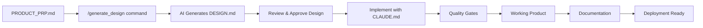

# Product Requirements Prompt (PRP) - Template

> **Getting Started with this Template**:
> 1. Clone the framework: `git clone [framework-repo-url]`
> 2. Create your project folder: `mkdir your-project-name`
> 3. Copy this template: `cp framework/PRODUCT_PRP.md your-project-name/`
> 4. Replace all `[PLACEHOLDER]` content with your specific project details
> 5. Delete this instruction block when creating your actual PRP
> 6. Generate your architecture: `/generate_design ./your-project-name/PRODUCT_PRP.md`
> 7. Execute your implementation: `/execute_project ./your-project-name`
> 8. Deploy your production-ready product!

## Product Information

**Product Name**: `[PRODUCT_NAME]`

> **Usage**: This product name will be used throughout the documentation, in generated DESIGN.md files, and for consistent referencing. Use a clear, descriptive name like "TaskFlow Pro", "ECommerce Platform", or "Inventory Manager".

## Product Objectives

[Provide a clear, concise statement of what `[PRODUCT_NAME]` does and why you're building it]

**Example patterns:**
- Build a [product type] that [primary function] for [target users]
- Create a [solution] to solve [specific problem] in the [domain/industry]
- Develop a [platform/tool/service] that enables [key capability] for [user group]

## Project Location

Please create a subfolder named `[project-name]` to contain all code and artifacts of `[PRODUCT_NAME]`.

**Naming conventions:**
- Use kebab-case: `my-awesome-project`
- Be descriptive but concise
- Avoid abbreviations unless widely understood

## Features

### Core Features (MVP)
[List the essential features needed for `[PRODUCT_NAME]` minimum viable product]

- [Feature 1]: [Brief description of functionality]
- [Feature 2]: [Brief description of functionality]
- [Feature 3]: [Brief description of functionality]

### Advanced Features (Future Phases)
[Optional: List features for future development phases]

- [Advanced Feature 1]: [Description]
- [Advanced Feature 2]: [Description]

### User Experience Requirements
[Describe key UX requirements and user flows for `[PRODUCT_NAME]`]

- **Authentication**: [User registration, login, profile management requirements]
- **Navigation**: [How users move through the application]
- **Data Management**: [How users create, read, update, delete data]
- **Notifications**: [Alert, notification, and communication requirements]
- **Accessibility**: [Accessibility standards and requirements]

## Technical Stack and Specifications

### Frontend Technology
[Choose and specify frontend technology with reasoning]

**Options:**
- **Web Application**: Next.js, App Router, JavaScript/TypeScript, Tailwind CSS
- **Mobile Application**: React Native, Flutter, or native iOS/Android
- **Desktop Application**: Electron, Tauri, or native development
- **CLI Tool**: Python, Node.js, Go, or Rust

### Backend Technology
[Specify backend requirements if applicable]

**Options:**
- **API Framework**: FastAPI (Python), Express.js (Node.js), Spring Boot (Java)
- **Database**: PostgreSQL, MySQL, MongoDB, SQLite
- **Authentication**: JWT, OAuth2, Auth0, Firebase Auth
- **File Storage**: Local storage, AWS S3, Google Cloud Storage
- **Caching**: Redis, Memcached, in-memory caching

### Infrastructure and Deployment
[Specify hosting and deployment requirements]

**Options:**
- **Hosting**: Vercel, Netlify, AWS, Google Cloud, Heroku
- **Database Hosting**: Supabase, PlanetScale, AWS RDS, MongoDB Atlas
- **CDN**: Cloudflare, AWS CloudFront, Vercel Edge Network
- **Monitoring**: Sentry, LogRocket, Datadog, New Relic

### Development Requirements
[Specify development tooling and standards]

- **Code Quality**: ESLint, Prettier, Black (Python), or equivalent linters
- **Testing**: Jest, Pytest, Cypress, or framework-appropriate testing tools
- **Version Control**: Git with conventional commit messages
- **CI/CD**: GitHub Actions, GitLab CI, or equivalent automation
- **Documentation**: README, API docs, component documentation

## Technical Specifications

### Performance Requirements
[Define performance expectations and constraints]

- **Load Time**: [Page load time requirements, e.g., < 3 seconds]
- **Response Time**: [API response time requirements, e.g., < 500ms]
- **Throughput**: [Concurrent users or requests per second]
- **Storage**: [Data storage and retention requirements]
- **Scalability**: [Expected growth and scaling requirements]

### Security Requirements
[Define security standards and compliance needs]

- **Data Protection**: [GDPR, CCPA, or other privacy compliance]
- **Authentication**: [Multi-factor authentication, password policies]
- **Authorization**: [Role-based access control, permissions]
- **Data Encryption**: [At rest and in transit encryption requirements]
- **Security Scanning**: [Vulnerability assessment requirements]

### Compatibility Requirements
[Define browser, device, and platform support]

- **Browser Support**: [Chrome, Firefox, Safari, Edge versions]
- **Device Support**: [Desktop, tablet, mobile responsiveness]
- **Operating Systems**: [Windows, macOS, Linux, iOS, Android]
- **Screen Sizes**: [Minimum and maximum supported resolutions]
- **Accessibility**: [WCAG compliance level, screen reader support]

## Development Guidance

### Architecture and Design Process
- Before actual development and implementation, create the architecture and design, and present it for review
- If the planned architecture and design meet the project goals, proceed with approval
- Follow established patterns from CLAUDE.md for code organization and structure

### Quality Assurance Standards
[Define quality gates and testing requirements]

- **Code Quality**: Run linting and formatting tools frequently during development
- **Testing Strategy**: Implement unit tests, integration tests, and end-to-end tests as appropriate
- **Build Verification**: Ensure the project builds successfully before declaring completion
- **Performance Testing**: Verify performance requirements are met
- **Security Testing**: Run security scans and vulnerability assessments

### Development Best Practices
[Specify coding standards and practices]

- Break down large code blocks into small, focused functions
- Refactor code into multiple files when files exceed reasonable size limits
- Use meaningful variable and function names that clearly express intent
- Implement proper error handling and logging throughout the application
- Follow the technology-specific conventions outlined in CLAUDE.md

### Success Criteria
[Define what "done" means for this project]

- [ ] All core features implemented and tested
- [ ] Application is completely lint-free and passes all quality gates
- [ ] Performance requirements met under expected load
- [ ] Security requirements satisfied
- [ ] Documentation complete and up-to-date
- [ ] Ready for deployment to production environment

## Examples and References

### Similar Products or Implementations
[Provide examples of existing solutions for reference]

- **Example 1**: [URL and description of what to learn from this example]
- **Example 2**: [URL and description of relevant features or patterns]
- **Code Repository**: [GitHub repo or code example with specific aspects to reference]

### Design Inspiration
[Visual or UX design references]

- **UI/UX Examples**: [Links to design systems, component libraries, or design inspiration]
- **Style Guides**: [Brand guidelines, color schemes, typography references]

### Technical References
[Documentation and technical resources]

- **Framework Documentation**: [Official docs for chosen technologies]
- **API References**: [External APIs or services to be integrated]
- **Standards and Specifications**: [Industry standards, RFCs, or specifications to follow]

## Documentation Requirements

### User Documentation
[Specify what documentation is needed for end users]

- **User Guide**: [Step-by-step instructions for using the product]
- **FAQ**: [Common questions and troubleshooting]
- **Video Tutorials**: [If applicable, video content requirements]

### Developer Documentation
[Specify technical documentation requirements]

- **Setup Instructions**: [Environment setup, installation, configuration]
- **API Documentation**: [If applicable, comprehensive API docs with examples]
- **Architecture Documentation**: [System design, data flow, component relationships]
- **Deployment Guide**: [Production deployment and maintenance procedures]

## Execution Workflow

### Phase 1: Planning and Design
1. **Read the existing `CLAUDE.md`** for Development Methodology (Engineering Standards)
2. **Generate `DESIGN.md`** using one of these methods:

**Option A: Claude CLI Command (Recommended)**
```bash
/generate_design
```

**Option B: Manual AI Prompt**
```
I have created a PRODUCT_PRP.md file with my project requirements and I'm using CLAUDE.md for development methodology. Please read both files and generate a comprehensive DESIGN.md document that includes:

1. Problem statement and context
2. Possible implementation approaches with trade-offs
3. Architecture and system design
4. Testing strategy (unit tests, integration tests, security scans)
5. Technology stack justification 
6. Project structure (tree-style directory layout)
7. External dependencies and integrations
8. Documentation references
9. Acceptance criteria and success metrics
10. Technical diagrams (Mermaid diagrams when helpful)

Please ensure the DESIGN.md follows the architecture patterns and quality standards defined in CLAUDE.md, and fully addresses all requirements specified in PRODUCT_PRP.md.
```

3. **Review the generated `DESIGN.md`** for Architecture & Implementation (Technical Design) ensuring it includes:
   - Problem statement and context
   - Possible implementation approaches
   - Architecture and system design
   - Testing strategy (unit tests, integration tests, security scans)
   - Technology stack justification
   - Project structure (tree-style directory layout)
   - External dependencies and integrations
   - Documentation references
   - Acceptance criteria and success metrics
   - Technical diagrams (Mermaid diagrams when helpful)

### Phase 2: Implementation
4. **Use this PRP, generated `DESIGN.md`, and `CLAUDE.md`** to guide implementation
5. **Follow iterative development** with regular quality checks and testing
6. **Maintain documentation** throughout the development process

### Phase 3: Quality Assurance and Deployment
7. **Complete all quality gates** defined in the success criteria
8. **Perform final testing** and security verification
9. **Prepare for deployment** with production-ready configuration

## Context Engineering Workflow



## Additional Considerations

### Risk Assessment
[Identify potential risks and mitigation strategies]

- **Technical Risks**: [Complex integrations, new technologies, performance concerns]
- **Timeline Risks**: [Dependencies, resource constraints, scope creep]
- **Security Risks**: [Data protection, compliance, vulnerability management]
- **Business Risks**: [Market fit, user adoption, competitive landscape]

### Maintenance and Support
[Define ongoing maintenance requirements]

- **Update Frequency**: [How often the product will be updated]
- **Support Level**: [User support, bug fixing, feature requests]
- **Monitoring**: [System monitoring, analytics, error tracking]
- **Backup and Recovery**: [Data backup strategies, disaster recovery]

### Future Considerations
[Plan for future development and scaling]

- **Roadmap**: [Future features and enhancements]
- **Scalability**: [Plans for handling growth]
- **Technology Evolution**: [Keeping up with technology changes]
- **Team Growth**: [Onboarding new developers, knowledge transfer]

---

## Template Usage Instructions

### How to Use This Template

1. **Copy this template** to create your specific project PRP
2. **Replace all `[PLACEHOLDER]` content** with your project details
3. **Delete sections** that don't apply to your project type
4. **Add additional sections** specific to your domain or requirements
5. **Review and refine** based on stakeholder feedback
6. **Use with CLAUDE.md and DESIGN.md** for complete context engineering

### Template Customization

**For Web Applications:**
- Focus on responsive design, browser compatibility, SEO
- Include progressive web app features if applicable
- Consider offline functionality and caching strategies

**For Mobile Applications:**
- Include platform-specific requirements (iOS/Android)
- Define app store submission requirements
- Consider push notifications, location services, camera access

**For APIs and Backend Services:**
- Focus on API design, documentation, rate limiting
- Include data modeling and database design requirements
- Define service level agreements (SLA) and monitoring

**For CLI Tools and Developer Tools:**
- Include command-line interface design
- Define installation and distribution methods
- Consider cross-platform compatibility

**For AI/ML Projects:**
- Include data requirements and model specifications
- Define training and inference infrastructure
- Consider ethics, bias, and explainability requirements

---

**This template follows Context Engineering best practices for systematic AI-assisted development.**