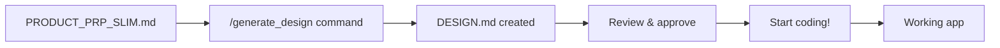

# Product Requirements Prompt (PRP) - Slim Template

> **Getting Started with this Template**:
> 1. Clone the framework: `git clone [framework-repo-url]`
> 2. Create your project folder: `mkdir my-simple-app`
> 3. Copy framework templates: `cp framework/* my-simple-app/`
> 4. Use this slim template for quick projects
> 5. Replace `[PLACEHOLDER]` content with your project details
> 6. Delete sections you don't need
> 7. Generate your architecture: `/generate_design ./my-simple-app/PRODUCT_PRP_SLIM.md`
> 8. Execute your implementation: `/execute_project ./my-simple-app`
> 9. Launch your finished product!

## Product Information

**Product Name**: `[PRODUCT_NAME]`

> **Usage**: This product name will be used throughout the documentation and in generated DESIGN.md files. Use a clear, descriptive name like "Todo App", "Recipe Finder", or "Budget Tracker".

## What Are You Building?

[Describe `[PRODUCT_NAME]` in 1-2 sentences - what it does and who it's for]

**Examples:**
- Build `TaskFlow Pro` - a todo app that helps freelancers track client projects and deadlines
- Create `DealFinder` - a price comparison tool for online shoppers to find the best deals
- Develop `WriterSpace` - a simple blog where writers can publish and share articles

## Project Setup

**Project Name**: `[project-name]` *(use kebab-case like: my-awesome-app)*

**Tech Stack**: [Choose one]
- **Web App**: Next.js + Tailwind CSS + JavaScript  
- **Mobile App**: React Native + Expo
- **Desktop App**: Electron + React
- **API/Backend**: FastAPI + Python
- **CLI Tool**: Python or Node.js
- **Static Site**: Next.js + Markdown

## Core Features (Must-Have)

- [ ] **[Feature 1]**: [Brief description of what it does]
- [ ] **[Feature 2]**: [Brief description of what it does]  
- [ ] **[Feature 3]**: [Brief description of what it does]
- [ ] **[Feature 4]**: [Brief description of what it does]

## Nice-to-Have Features (Future)

- [ ] **[Future Feature 1]**: [Description]
- [ ] **[Future Feature 2]**: [Description]

## User Experience

**Target Users**: [Who will use `[PRODUCT_NAME]`? e.g., students, small business owners, developers]

**Key User Flow**: [Describe the main thing users do with `[PRODUCT_NAME]`]
1. User opens the app
2. User [main action]
3. User sees [result]
4. User can [secondary actions]

**Data Storage**: [Choose one]
- **Local Storage** - Data stays in browser/device
- **Database** - User data saved online (requires backend)
- **Files** - Import/export files
- **No Storage** - Each session starts fresh

## Technical Requirements

### Performance
- **Load Time**: Under 3 seconds
- **Works On**: [Desktop/Mobile/Both]
- **Browser Support**: Modern browsers (Chrome, Firefox, Safari, Edge)

### Data & Security
- **User Data**: [What data do you collect? Keep minimal]
- **Authentication**: [None/Simple login/Social login]
- **Data Protection**: [Any special requirements?]

## Visual Design

**Style**: [Modern/Minimalist/Colorful/Professional/Fun]

**Key UI Elements**:
- Main navigation/menu
- Primary action buttons
- Data display (lists/cards/tables)
- Forms for user input

**Inspiration**: [Any apps/sites you want it to look like?]

## Success Criteria

`[PRODUCT_NAME]` is complete when:
- [ ] All core features work without bugs
- [ ] App loads quickly and feels responsive  
- [ ] Users can complete the main workflow easily
- [ ] Code is clean and well-organized
- [ ] Basic testing is done

## Examples & References

**Similar Apps**: [Links to apps that do something similar]

**Design Inspiration**: [Links to designs you like]

**Technical Examples**: [Any code examples or tutorials to reference]

## Quick Implementation Plan

### Phase 1: Core Setup (Day 1)
1. Set up project structure
2. Create basic UI layout
3. Implement main navigation

### Phase 2: Core Features (Days 2-3)
1. Build Feature 1: [Name]
2. Build Feature 2: [Name]  
3. Connect features together

### Phase 3: Polish (Day 4)
1. Add styling and polish UI
2. Test everything works
3. Fix any bugs found

### Phase 4: Deploy (Day 5)
1. Test in production environment
2. Deploy to hosting platform
3. Share with initial users

## Generate Your Architecture

**Ready to build?** Use one of these methods to create your DESIGN.md:

**Option A: Claude CLI Command (Recommended)**
```bash
/generate_design
```

**Option B: Manual Prompt**
```
I have created a PRODUCT_PRP.md file with my project requirements and I'm using CLAUDE.md for development methodology. Please read both files and generate a comprehensive DESIGN.md document that includes:

1. Problem statement and context
2. Architecture and system design  
3. Technology stack justification
4. Project structure (directory layout)
5. Implementation approach
6. Testing strategy
7. Acceptance criteria

Please ensure the DESIGN.md follows the architecture patterns defined in CLAUDE.md and addresses all requirements in this PRP.
```

## Context Engineering Workflow



---

## 💡 Tips for Success

### **Keep It Simple**
- Start with core features only
- Add polish after basic functionality works
- Don't overcomplicate the first version

### **Plan Your Data**
- Decide early how data flows through your app
- Keep data structures simple and consistent
- Plan for user actions (create, read, update, delete)

### **Test As You Go**
- Test each feature as you build it
- Ask friends/family to try it early
- Fix problems immediately, don't let them pile up

### **Focus on User Value**
- Every feature should solve a real user problem
- If you can't explain why a feature matters, cut it
- Better to do 3 things well than 10 things poorly

---

**Ready to start building? Follow the three-document pattern:**
1. **Complete this PRP** with your specific requirements
2. **Use CLAUDE.md** for development methodology  
3. **Generate DESIGN.md** for technical architecture
4. **Start coding** with complete context!

*This slim template is part of The Three-Document Pattern Context Engineering Framework.*