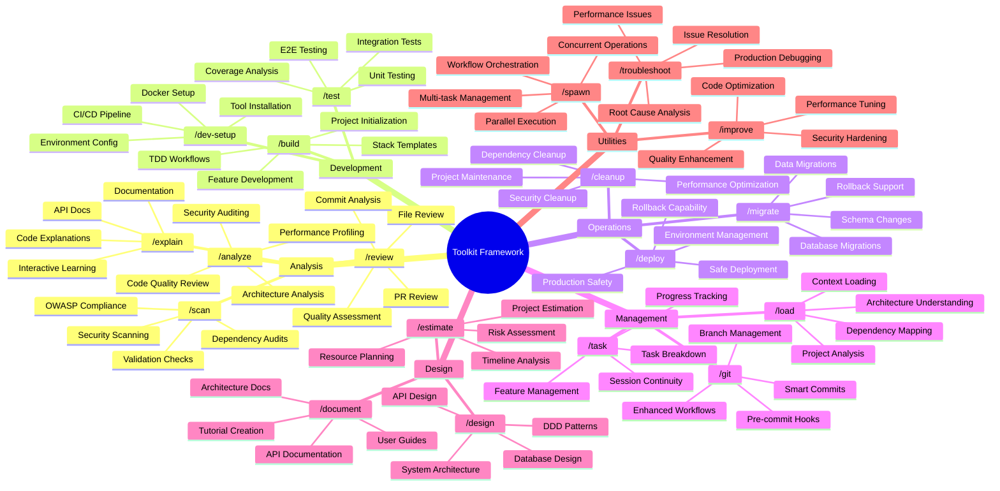
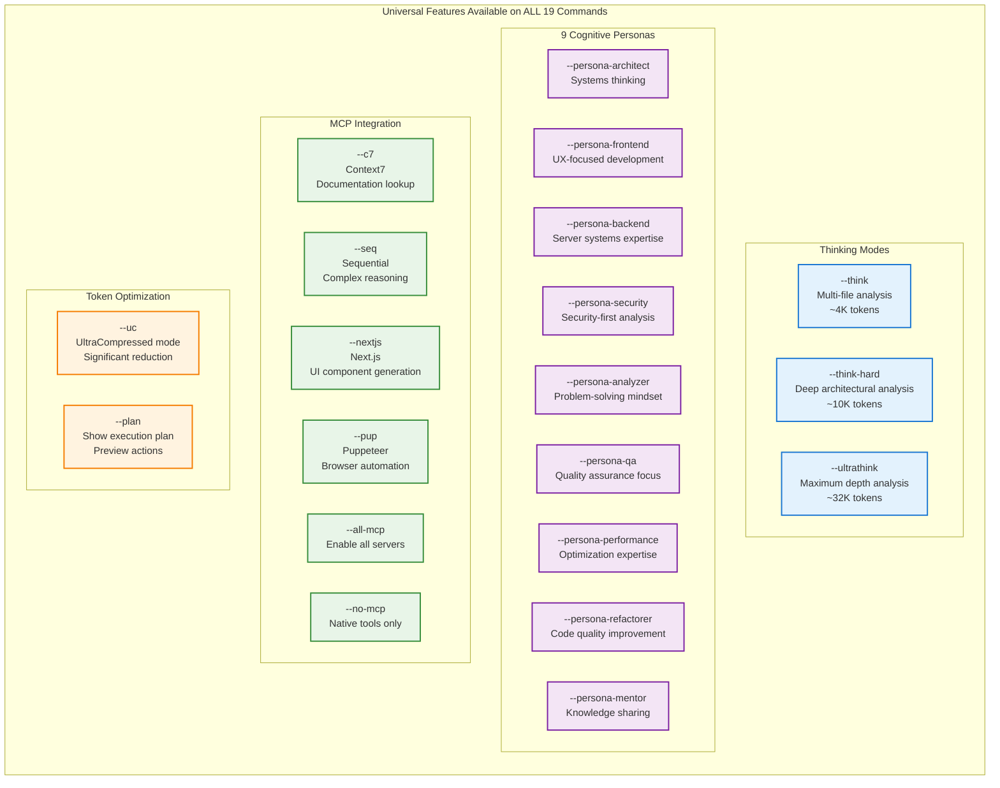
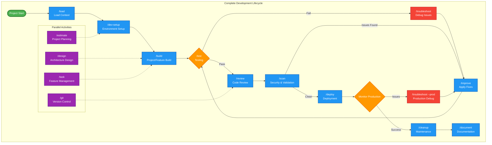

# Claude Toolkit Complete Commands Tutorial

## 🚀 Quick Start Guide

Toolkit provides **19 specialized commands** that transform Claude Code into a powerful development framework. Each command includes **universal flags**, **cognitive personas**, and **MCP integration**.

### Basic Syntax
```bash
/command [--flags] [arguments]
```

## 📊 Toolkit Command Architecture

### 🏗️ Framework Overview



### 🧠 Universal Features Matrix



### 🎯 Development Workflow Visualization



### 📋 Command Categories & Use Cases

| Category | Commands | Primary Use Cases | Key Features |
|----------|----------|-------------------|--------------|
| **🔍 Analysis** | `/analyze` `/review` `/scan` `/explain` | Code quality, security audits, documentation | Multi-dimensional analysis, AI-powered insights |
| **🏗️ Development** | `/build` `/dev-setup` `/test` | Project creation, environment setup, testing | Stack templates, TDD workflows, comprehensive testing |
| **🚀 Operations** | `/deploy` `/migrate` `/cleanup` | Deployment, database changes, maintenance | Safe deployments, rollback support, automated cleanup |
| **📋 Management** | `/task` `/load` `/git` | Project management, context loading, version control | Session continuity, smart workflows, enhanced Git |
| **🎨 Design & Planning** | `/design` `/document` `/estimate` | Architecture design, documentation, planning | System design, API docs, resource estimation |
| **🔧 Utilities** | `/troubleshoot` `/improve` `/spawn` | Debugging, optimization, parallel execution | Production debugging, performance tuning, workflow orchestration |

---

## 🧠 Universal Features (Available on ALL Commands)

### **Thinking Depth Control**
- `--think` → Multi-file analysis (~4K tokens)
- `--think-hard` → Deep architectural analysis (~10K tokens)  
- `--ultrathink` → Maximum depth analysis (~32K tokens)

### **Token Optimization**
- `--uc` / `--ultracompressed` → Significant token reduction
- `--no-mcp` → Native tools only (fastest)

### **Cognitive Personas (9 Available)**
- `--persona-architect` → Systems thinking approach
- `--persona-frontend` → UX-focused development
- `--persona-backend` → Server systems expertise
- `--persona-security` → Security-first analysis
- `--persona-analyzer` → Problem-solving mindset
- `--persona-qa` → Quality assurance focus
- `--persona-performance` → Optimization expertise
- `--persona-refactorer` → Code quality improvement
- `--persona-mentor` → Knowledge sharing approach

### **MCP Server Integration**
- `--c7` → Context7 (documentation lookup)
- `--seq` → Sequential (complex reasoning)
- `--pup` → Puppeteer (browser automation)
- `--all-mcp` → Enable all servers

---

## 📚 Complete Command Reference

### **🔍 Analysis Commands**

#### `/analyze` - Multi-dimensional code analysis
**Purpose**: Comprehensive code, architecture, and system analysis

```bash
# Code quality review
/analyze --code --think

# Architecture deep-dive
/analyze --arch --think-hard --persona-architect

# Security audit
/analyze --security --ultrathink --persona-security

# Performance profiling
/analyze --profile --seq --persona-performance
```

**Analysis Modes**:
- `--code` → Quality review, bug detection, security checks
- `--arch` → System design patterns, coupling analysis
- `--profile` → CPU, memory, execution time analysis
- `--security` → OWASP top 10, vulnerability assessment
- `--perf` → Bottleneck analysis, optimization recommendations
- `--watch` → Continuous monitoring
- `--interactive` → Guided step-by-step analysis

#### `/review` - AI-powered code review
**Purpose**: Comprehensive code review with quality analysis

```bash
# File review with security focus
/review --files src/auth.ts --persona-security

# Commit review with evidence
/review --commit HEAD --quality --evidence

# PR review (comprehensive)
/review --pr 123 --all --interactive --think-hard
```

**Review Modes**:
- `--files` → Review specific files/directories
- `--commit` → Review git commit changes
- `--pr` → Pull request review
- `--quality` → Focus on code quality (DRY, SOLID)
- `--evidence` → Include sources for suggestions
- `--fix` → Suggest specific fixes
- `--summary` → Executive summary of findings

#### `/scan` - Security and validation scanning
**Purpose**: Security audits and code validation

```bash
# OWASP security scan
/scan --security --owasp --deps

# Validation scan
/scan --validate --strict --persona-qa

# Dependency audit
/scan --deps --vulnerabilities --c7
```

**Scan Types**:
- `--security` → Security vulnerability scanning
- `--validate` → Code validation and compliance
- `--deps` → Dependency analysis
- `--owasp` → OWASP Top 10 security checks
- `--strict` → Enhanced validation rules

#### `/explain` - Documentation and explanations
**Purpose**: Generate documentation and explanations

```bash
# Expert-level explanation
/explain --depth expert --visual "React hooks"

# Interactive learning
/explain --interactive --c7 --seq

# Documentation generation
/explain --docs --api --nextjs
```

**Explanation Modes**:
- `--depth` → beginner|intermediate|expert|master
- `--visual` → Include diagrams and visuals
- `--interactive` → Interactive learning mode
- `--docs` → Generate documentation
- `--api` → API documentation focus

---

### **🏗️ Development Commands**

#### `/build` - Universal project builder
**Purpose**: Build projects and features with stack templates

```bash
# New Next.js project
/build --init --nextjs --tailwind --shadcn 

# Python CLI application
/build --python --cli --click --config

# Feature development with TDD
/build --feature --tdd --persona-frontend

# Full-stack project
/build --fullstack --docker --watch
```

**Build Templates**:
- `--react` → Vite + TypeScript + Router + Testing
- `--api` → Express + TypeScript + Auth + OpenAPI
- `--fullstack` → React + Node.js + Docker
- `--mobile` → React Native + Expo
- `--cli` → Python CLI with Click, Typer, or argparse
- `--python` → Python project with CLI support

**Build Modes**:
- `--init` → New project with stack selection
- `--feature` → Implement feature in existing project
- `--tdd` → Test-driven development workflow
- `--watch` → Continuous build with live reload
- `--interactive` → Step-by-step configuration

#### `/dev-setup` - Development environment
**Purpose**: Setup and configure development environment

```bash
# Complete development setup
/dev-setup --install --ci --monitor

# Docker environment
/dev-setup --docker --postgres --redis

# CI/CD pipeline
/dev-setup --ci --github-actions --testing
```

**Setup Options**:
- `--install` → Install dependencies and tools
- `--ci` → CI/CD pipeline setup
- `--docker` → Docker environment configuration
- `--monitor` → Monitoring and logging setup
- `--github-actions` → GitHub Actions workflow

#### `/test` - Testing framework
**Purpose**: Comprehensive testing with multiple strategies

```bash
# Test with coverage
/test --coverage --e2e --strict

# TDD workflow
/test --tdd --watch --persona-qa

# Integration testing
/test --integration --pup --c7
```

**Test Types**:
- `--unit` → Unit testing
- `--integration` → Integration testing
- `--e2e` → End-to-end testing
- `--coverage` → Code coverage analysis
- `--tdd` → Test-driven development
- `--watch` → Continuous testing
- `--strict` → Enhanced test validation

---

### **🚀 Operations Commands**

#### `/deploy` - Safe application deployment
**Purpose**: Deploy applications with safety checks and rollback

```bash
# Staging deployment
/deploy --env staging --think

# Production deployment (careful!)
/deploy --env prod --think-hard --validate

# Emergency rollback
/deploy --rollback --ultrathink
```

**Deployment Options**:
- `--env dev|staging|prod` → Target environment
- `--rollback` → Revert to previous deployment
- `--validate` → Pre-deployment validation
- `--plan` → Show deployment plan first

#### `/migrate` - Database and code migrations
**Purpose**: Safe database and code migrations

```bash
# Safe migration with dry-run
/migrate --dry-run --rollback --validation

# Production migration
/migrate --prod --backup --think-hard

# Schema migration
/migrate --schema --postgres --indexes
```

**Migration Types**:
- `--dry-run` → Preview migration without execution
- `--rollback` → Rollback capability
- `--backup` → Create backup before migration
- `--schema` → Database schema changes
- `--data` → Data migration

#### `/cleanup` - Project maintenance
**Purpose**: Clean and maintain project files

```bash
# Complete cleanup
/cleanup --all --validate --deps

# Security cleanup
/cleanup --security --logs --temp-files

# Performance cleanup
/cleanup --performance --cache --optimize
```

**Cleanup Types**:
- `--all` → Comprehensive cleanup
- `--security` → Security-related cleanup
- `--performance` → Performance optimization
- `--deps` → Dependency cleanup
- `--validate` → Validate after cleanup

---

### **📋 Management Commands**

#### `/task` - Complex feature management
**Purpose**: Manage complex features across sessions

```bash
# Create complex feature task
/task:create "Implement OAuth 2.0 authentication"

# Check task status
/task:status oauth-task-id

# Resume interrupted work
/task:resume oauth-task-id

# Update task with discoveries
/task:update oauth-task-id "Found security issue"
```

**Task Operations**:
- `:create` → Create new complex task
- `:status` → Check task progress
- `:resume` → Resume work after interruption
- `:update` → Update task with new information
- `:complete` → Mark task as completed

#### `/load` - Project context loading
**Purpose**: Load and understand project context

```bash
# Load full project context
/load --context --dependencies

# Load with analysis
/load --analyze --architecture --seq

# Quick context load
/load --uc --fast
```

**Loading Options**:
- `--context` → Full project context
- `--dependencies` → Analyze dependencies
- `--analyze` → Include analysis
- `--architecture` → Focus on architecture
- `--fast` → Quick loading mode

#### `/git` - Enhanced Git workflows
**Purpose**: Advanced Git operations with safety

```bash
# Smart commit with analysis
/git --commit --analyze --quality

# Branch sync with safety
/git --sync --backup --validate

# Pre-commit integration
/git --pre-commit --security --testing
```

**Git Operations**:
- `--commit` → Smart commit with analysis
- `--sync` → Safe branch synchronization
- `--pre-commit` → Pre-commit hook setup
- `--backup` → Create backup checkpoints
- `--validate` → Validate before operations

---

### **🎨 Design & Planning Commands**

#### `/design` - System architecture
**Purpose**: Design system architecture and APIs

```bash
# API design with DDD
/design --api --ddd --bounded-context

# Database design
/design --database --postgres --performance

# System architecture
/design --system --microservices --seq
```

**Design Types**:
- `--api` → API design and specification
- `--database` → Database schema design
- `--system` → System architecture design
- `--ddd` → Domain-driven design
- `--microservices` → Microservices architecture

#### `/document` - Documentation creation
**Purpose**: Create comprehensive documentation

```bash
# API documentation
/document --api --openapi --interactive

# User documentation
/document --user --tutorials --nextjs

# Architecture documentation
/document --architecture --diagrams --c7
```

**Documentation Types**:
- `--api` → API documentation
- `--user` → User guides and tutorials
- `--architecture` → System architecture docs
- `--openapi` → OpenAPI specification
- `--diagrams` → Include visual diagrams

#### `/estimate` - Project estimation
**Purpose**: Estimate project scope and resources

```bash
# Detailed estimation
/estimate --detailed --worst-case --seq

# Quick estimation
/estimate --quick --complexity

# Resource planning
/estimate --resources --timeline --risk
```

**Estimation Types**:
- `--detailed` → Comprehensive estimation
- `--quick` → Rapid estimation
- `--worst-case` → Conservative estimates
- `--resources` → Resource planning
- `--timeline` → Timeline estimation
- `--risk` → Risk assessment

---

### **🔧 Utility Commands**

#### `/troubleshoot` - Debugging and issue resolution
**Purpose**: Debug issues and resolve problems

```bash
# Production debugging
/troubleshoot --prod --five-whys --seq

# Interactive debugging
/troubleshoot --interactive --fix --persona-analyzer

# Performance troubleshooting
/troubleshoot --performance --profile --think-hard
```

**Troubleshooting Modes**:
- `--prod` → Production issue debugging
- `--performance` → Performance issues
- `--interactive` → Interactive debugging
- `--five-whys` → Root cause analysis
- `--fix` → Suggest fixes

#### `/improve` - Enhancement and optimization
**Purpose**: Improve and optimize code/systems

```bash
# Performance optimization
/improve --performance --threshold 95% --iterate

# Code quality improvement
/improve --quality --refactor --persona-refactorer

# Security hardening
/improve --security --validate --persona-security
```

**Improvement Types**:
- `--performance` → Performance optimization
- `--quality` → Code quality improvements
- `--security` → Security enhancements
- `--refactor` → Code refactoring
- `--iterate` → Iterative improvements

#### `/spawn` - Parallel task execution
**Purpose**: Execute multiple tasks in parallel

```bash
# Parallel development tasks
/spawn --tasks "test,build,lint" --parallel

# Multi-environment deployment
/spawn --deploy staging,prod --sequential

# Parallel analysis
/spawn --analyze "security,performance,quality"
```

**Execution Modes**:
- `--parallel` → Execute tasks simultaneously
- `--sequential` → Execute tasks in order
- `--tasks` → Specify task list
- `--deploy` → Multi-environment deployment

---

## 🎯 Workflow Examples

### **🚀 New Project Setup**
```bash
/load --context                            # Load existing code
/dev-setup --install --ci                  # Setup environment
/build --init --nextjs --tailwind --shadcn # Create Next.js project
/test --coverage --setup                   # Setup testing
/git --init --pre-commit                   # Git configuration
```

### **🔧 Python CLI Development**
```bash
/dev-setup --type cli --python --tools     # CLI development environment
/build --python --cli --click --config     # Create CLI with Click
/test --cli --command-testing --integration # CLI testing
/document --cli --help-generation --man-pages # CLI documentation
/deploy --cli --pypi --env prod            # Deploy to PyPI
```

### **🔍 Feature Development Workflow**
```bash
/analyze --code --think --persona-architect    # Understand codebase
/design --feature --api --ddd                  # Design the feature
/build --feature --tdd --nextjs                # Implement with tests
/test --e2e --coverage --pup                   # End-to-end testing
/review --commit HEAD --quality --evidence     # Review changes
/deploy --env staging --validate               # Deploy to staging
```

### **🚨 Production Issue Resolution**
```bash
/troubleshoot --prod --investigate --ultrathink    # Analyze the issue
/analyze --profile --performance --seq             # Performance analysis
/improve --performance --fix --threshold 95%       # Apply fixes
/test --regression --e2e --critical                # Regression testing
/deploy --env prod --rollback-ready               # Careful deployment
```

### **🔒 Security Audit Workflow**
```bash
/scan --security --owasp --deps --persona-security    # Security scan
/analyze --security --ultrathink --c7                 # Deep analysis
/improve --security --fix --validate                  # Apply fixes
/test --security --penetration --pup                  # Security testing
/document --security --compliance                     # Document findings
```

### **📈 Performance Optimization**
```bash
/analyze --profile --performance --think-hard     # Identify bottlenecks
/improve --performance --iterate --seq             # Optimize iteratively
/test --performance --benchmarks --pup            # Performance testing
/review --performance --evidence --persona-performance  # Review optimizations
```

---

## 🎨 Advanced Flag Combinations

### **🧠 Power User Patterns**
```bash
# Deep architecture analysis
/analyze --architecture --seq --think-hard --persona-architect

# UI development with testing
/build --nextjs --tailwind --shadcn --pup --watch --persona-frontend

# CLI development with testing
/build --python --cli --typer --testing --persona-backend

# Production deployment safety
/scan --validate --seq → /deploy --env prod --think-hard

# Emergency debugging
/troubleshoot --prod --ultrathink --seq --persona-analyzer
```

### **⚡ Token-Optimized Workflows**
```bash
# Efficient development cycle
/build --uc → /test --uc → /deploy --uc

# Fast analysis
/analyze --uc --no-mcp → /improve --uc

# Compressed documentation
/document --uc → /explain --uc --c7
```

### **🔬 Research & Learning**
```bash
# Library documentation study
/explain --c7 --seq --depth expert "React hooks"

# Architecture learning
/design --ddd --seq --think-hard → /document --api

# Performance learning
/analyze --profile --seq → /improve --iterate --threshold 95%
```

---

## 🛡️ Safety & Best Practices

### **🚨 Pre-Deployment Checklist**
```bash
# Complete safety gate
/test --coverage --e2e
/scan --security --owasp
/scan --validate --strict
/deploy --env staging
/test --e2e --staging
/deploy --env prod --plan
```

### **🔄 Safe Development Patterns**
```bash
# Git checkpoint for safety
/git --checkpoint → /build --feature → /test

# Rollback-ready deployment
/deploy --env prod --rollback-ready

# If issues: /deploy --rollback --ultrathink
```

### **🎯 Command Selection Guide**

**For New Projects**: `/load` → `/dev-setup` → `/build --init`  
**For Features**: `/analyze` → `/design` → `/build --feature`  
**For Debugging**: `/troubleshoot` → `/analyze` → `/improve`  
**For Quality**: `/review` → `/scan` → `/improve`  
**For Deployment**: `/test` → `/scan` → `/deploy`

---

## 🚀 Getting Started Tips

1. **Start with `/load`** to understand your project
2. **Use `--plan`** to preview actions before execution
3. **Combine personas** with thinking modes for best results
4. **Use `--uc`** for token efficiency in large projects
5. **Always test** before deploying with `/test --coverage`
6. **Use `/git --checkpoint`** before major changes

## 🤝 Contributing to Toolkit

The Toolkit framework is designed to be extensible. You can:

- **Add new commands** using the template system
- **Create custom personas** for specialized workflows
- **Extend MCP integrations** for new capabilities
- **Improve existing patterns** through the YAML configuration

See [CONTRIBUTING.md](CONTRIBUTING.md) for details on extending the framework.

---

**Remember**: Every command supports all universal flags and personas for maximum flexibility!

---

*Claude Toolkit – Complete Commands Tutorial*  
*19 specialized commands • 9 cognitive personas • Universal flag system • MCP integration*